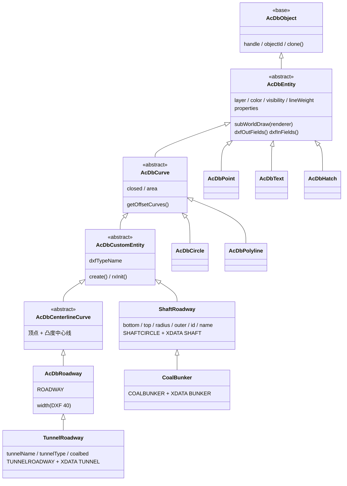

# 绘制巷道插件（cad-tunnel-plugin）设计文档

- 日期：2026-09-07
- 包：`cad-viewer/packages/cad-tunnel-plugin`
- 遵循规范：[功能插件开发标准](../../../docs/04-开发规范/功能插件开发标准.md)、
  [自定义实体开发指南](../../../docs/04-开发规范/自定义实体开发指南.md)
- 数据示例：仓库根 `GeoJSON/tunnel.json`

## 1. 目标

在查看器 Ribbon 的「实用工具」（Utilities）分组提供 **绘制巷道** 按钮，把 HTTP 接口
（如 axios 请求）返回的 GeoJSON 巷道数据直接绘制为图纸对象——点、线、面、文字，
**不经过任何 DWG/DXF 解析**。库包（`cad-simple-viewer` / `cad-viewer` / `data-model`）
零改动，与上游保持可合并。

## 2. 架构

```
GeoJSON 数据源 (URL, fetch)
        │
        ▼
parseTunnelGeoJson()       包装格式归一化（data.params.data 信封 / 标准 GeoJSON）
        │
        ▼
geojsonToEntities()        纯转换器：FeatureCollection → 实体数组
        │                    ├─ LineString(巷道属性) → TunnelRoadway（AcDbRoadway 子类）
        │                    ├─ 其他 LineString      → AcDbPolyline
        │                    ├─ Point               → AcDbPoint
        │                    ├─ Polygon             → 闭合 AcDbPolyline + AcDbHatch(SOLID)
        │                    └─ tunnelName 属性      → 标签候选队列 → 碰撞避让 → AcDbText
        ▼
AcApDrawTunnelCmd           acapRunDatabaseEdit 事务：建图层 + appendEntity 批量入库
        │                    （entityAppended 事件自动入视图渲染，无需手动 render）
        ▼
zoomToFitDrawing()          缩放到全图

巷道设置面板（DOM 注入，Ribbon「巷道设置」按钮开关）
        │
        ▼
updateTunnelEntities()      acapRunDatabaseEdit 事务内逐实体 openForWrite：
                            线宽 → TunnelRoadway.width；名称大小 → AcDbText.height；
                            碰撞避让 → 重算可见性 AcDbText.visibility
                            （entityModified 事件自动刷新视图）
```

### 2.1 自定义绘制对象继承关系

插件绘制的三个自定义实体（★）与数据模型内置实体的继承关系；灰色为库包
（`data-model`）类，蓝色为插件包类：



要点：

- `TunnelRoadway`（普通巷道）与 `ShaftRoadway`（立井）是两条**并列**的自定义实体支线：
  前者走 `AcDbCenterlineCurve → AcDbRoadway`（中心线 + 宽度，按宽带状实心填充渲染），后者直接继承
  `AcDbCustomEntity`（自绘符号，几何全部由 `subWorldDraw` 产出）；
- `CoalBunker`（煤仓）复用立井的全部字段与 DXF 机制，仅覆盖符号绘制（+4 条竖向刻度线）、
  默认名、子类标记与 XDATA 应用名；
- 三个插件实体都通过 `rxInit()` 注册进 DXF 自定义实体注册表（在 `AcApTunnelPlugin.onLoad`
  显式调用，受 `entityRegistered` 标志防重复注册）；`AcDbCircle`/`AcDbPolyline`/
  `AcDbPoint`/`AcDbText`/`AcDbHatch` 是转换器为其余几何创建的库内置实体。

## 3. 关键决策

| 决策 | 选择 | 理由 |
| --- | --- | --- |
| 加载策略 | 急切（应用启动注册） | Ribbon 按钮必须首次交互前就位（同 invertsel 插件） |
| Ribbon 接入 | DOM 注入（克隆 `cmd-qselect` 模板） | 宿主 Ribbon 无扩展点；库零入侵（规范 §5.4） |
| HTTP 客户端 | 原生 `fetch` | 仓库无 axios 依赖；接口返回普通 JSON，无需额外能力 |
| 线实体 | 带 `tunnelType/tunnelName/coalbed` 属性的 LineString → `TunnelRoadway` | 巷道语义（中心线 + width 参数、属性面板、DXF 往返）；其余线退化 `AcDbPolyline` |
| 特殊巷道类型 | `tunnelType` ∈ {1,2,9,15} → `ShaftRoadway`（立井符号：双圆 + 直径线）；`tunnelType` = 3 → `CoalBunker`（煤仓符号：立井 + 4 条竖向刻度线），取线两端 Z 较高者为井口、较低者为井底（点要素井口 = 井底） | 按业务参考实现（MxCAD ShaftCircle/CoalBunker）逐原语等价：外圈 = 半径 + outer、内圈 = 半径、直径线与刻度线坐标一致；数字或数字字符串 `tunnelType` 均可识别 |
| 巷道属性展示 | 插件内 `TunnelRoadway extends AcDbRoadway`，覆盖 `properties` getter 追加「巷道信息」分组 | `AcDbEntity.properties` 是公开 getter，插件可子类化扩展属性面板，无需改库；名称用中文原文 + `skipTranslation`（宿主 i18n 无插件词条） |
| 属性持久化 | XDATA（应用名 `TUNNEL`，三条 `1000`） | 中心线读取器读到 `1001` 前自动停止（`atExtendedData`），子类在 `dxfInFields` 尾部补读；不破坏父类 DXF 结构 |
| 特殊类型持久化 | `ShaftRoadway`（DXF `SHAFTCIRCLE`）/ `CoalBunker`（`COALBUNKER`）各自独立子类标记 + 点位码（10/20/30 井口、11/21/31 井底、40 半径、41 外圈）+ XDATA（`SHAFT`/`BUNKER`） | 与 `TunnelRoadway` 同一套自定义实体注册 / DXF 往返机制；CoalBunker 继承 ShaftRoadway，仅覆盖标记、默认名、绘制原语与属性分组名 |
| 高程（Z） | 默认 `ignore`（Z=0） | 2D 矿图语义；且相机深度带（near 0.1 / far 1000，cam z=500）裁剪 Z 超出约 ±500 的实体——数据绝对高程 1628~1932 不可见 |
| 文字高度 | 默认按数据包围盒对角线 ×0.0035 自适应（`deriveAutoLabelHeight`） | 原 0.008 的标签在全图上占视口宽约 5%，观感过大；0.0035 约 2%，且面板可显式覆盖 |
| 标签碰撞避让 | 转换期收集候选（优先级 = 几何长度，长者优先）→ 贪心保留不重叠标签（`labelCollision` 默认开） | 名称密集区域直接叠加不可读；按长度排序保证主要巷道优先显示 |
| 设置面板 | 自绘 DOM 浮动面板 + Ribbon「巷道设置」按钮开关；控件变化防抖（300ms）后自动应用，走 `openObjectForWrite` + 事务 | 宿主无通用面板扩展 API（同 Ribbon）；连续调整合并为一次事务，提交派发 `entityModified` → 视图自动刷新，且可撤销 |
| 图层 | 巷道点/巷道线/巷道面/巷道文字，按需创建 | 可整层控制显隐、`tunnelclear` 按层清除 |
| 配置注入 | `registerTunnelPlugin(manager, options)` 构造参数 → 插件 `onLoad` 写入主包模块状态 | register 与主包是两个构建产物，跨 chunk 模块状态不共享，不能由 register 直接写入 |

## 4. 数据格式兼容

`parseTunnelGeoJson` 支持：

1. 标准 GeoJSON `FeatureCollection` / 单个 `Feature` / 单个几何对象
2. `Feature` 数组
3. 业务信封 `{ data: { params: { data: <geojson> } } }`（tunnel.json 形状）
4. `{ data: <geojson> }`

几何类型：Point / MultiPoint / LineString / MultiLineString / Polygon /
MultiPolygon / GeometryCollection。Multi* 与 GeometryCollection 的标签只标注
第一个子几何（避免重复文字）。

## 5. 命令

| 命令 | 别名 | 行为 |
| --- | --- | --- |
| `drawtunnel` | `tunnel` | 用配置的 URL（或命令行输入）拉取并绘制；完成后缩放到全图；日志 `[cad-tunnel]` 前缀 |
| `tunnelclear` | — | 删除巷道图层上的全部对象（可 undo） |

`drawtunnel` 只读文档下不可用（`AcEdOpenMode.Write`）。

## 6. 配置项（TunnelDrawOptions）

| 项 | 默认 | 说明 |
| --- | --- | --- |
| `url` | — | 数据地址；缺省时命令提示输入 |
| `layerNames` | 巷道点/线/面/文字 | 分类图层名覆盖 |
| `labelField` | `'tunnelName'` | 文字标注取值的属性名；`null` 关闭 |
| `labelHeight` | 0（自适应） | 文字高度 |
| `labelCollision` | true | 名称碰撞避让；关闭后全部名称都绘制 |
| `roadwayWidth` | 2 | 巷道实体宽度 |
| `shaftRadius` | 15 | 立井/煤仓符号内圈半径（图纸单位） |
| `shaftOuter` | 5 | 立井/煤仓符号外圈加宽（图纸单位） |
| `useRoadway` | true | 巷道属性线是否建 `TunnelRoadway` |
| `fillPolygons` | true | 面是否加 SOLID 填充 |
| `elevationMode` | `'ignore'` | `'relative'` 保留相对高差 |
| `fitView` | true | 绘制后缩放到全图 |
| `color` | — | 特征无 `color` 时的兜底色 |

## 7. 已知限制与回退清单

- **Ribbon DOM 注入边界**（同 invertsel 插件）：与 `@mlightcad/ribbon` 内部 DOM 结构
  （`data-group-id` / `data-item-id` / class 名）耦合，宿主 ribbon 升级须回归；不参与
  窄宽折叠；提示用原生 `title`。若未来宿主提供正式扩展点应迁移。
- **设置面板为自绘 DOM**：样式基于 `html.dark` 跟随宿主明暗主题，但不会随宿主布局
  变化停靠；`position: fixed` 于视口右上角，`z-index: 3000`。
- **巷道实体仅 DXF 往返**：`TunnelRoadway` 是自定义实体，二进制 DWG 读取分发不查注册表
  （见自定义实体开发指南 FAQ Q1）；且其巷道属性以 XDATA 存取，未加载插件时属性静默丢失。
- **碰撞检测是启发式**：标签宽度按 CJK=1 / ASCII=0.55 倍字高估算，非像素级精确；
  仅做名称与名称的二维碰撞，不避让其他几何。
- **绝对高程被归零**：`elevationMode: 'ignore'` 下 Z 不保留；需保留高差用 `'relative'`
  （受相机深度带限制，仅适合相对高差 <约 500 的 2D 场景）。
- **绘制不清旧数据会叠加**：重画前先 `tunnelclear`。
- 仅处理 `properties.color` 为 hex/颜色名的情形；其他字符串忽略（回退 ByLayer）。

## 8. 测试

`__tests__/` 覆盖：信封/标准格式归一化、巷道/普通线/面/点映射、`TunnelRoadway`
属性注入与 DXF 往返、`ShaftRoadway`/`CoalBunker` 构造默认值与属性组（立井信息 /
煤仓信息：巷道 id、巷道名称、井底/井口坐标）、DXF 往返（子类标记 + 点位码 + XDATA）、
特殊 tunnelType 分流（立井取线两端 Z 高低、点→煤仓、数字 tunnelType 保留、半径选项）、
闭合与填充开关、相对高程、标签字段、颜色兜底、空数据、
标签宽度估算 / 碰撞贪心、`updateTunnelEntities`（线宽、名称大小、自动高度、
碰撞显隐）。运行：

```bash
cd cad-viewer
npx jest packages/cad-tunnel-plugin
```
