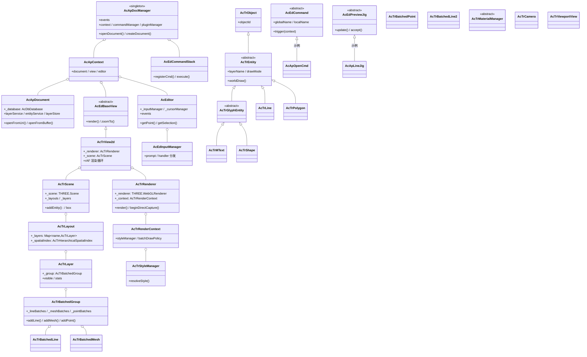

# cad-viewer 类结构详解

> 面向包：`cad-viewer/packages/cad-viewer`（Vue UI 层）、`cad-viewer/packages/cad-simple-viewer`（引擎核心）、`cad-viewer/packages/three-renderer`（渲染层）
> 文档定位：系统梳理查看器三层（引擎 / 渲染 / UI）的类结构、职责划分与关键调用链。
> 源码基准：当前 `dev_hy` 分支代码；类名、继承关系、文件路径均与源码一致。
> 关联阅读：[架构图.md](./架构图.md)、[data-model解析器类结构详解.md](./data-model解析器类结构详解.md)、[高性能技术分析.md](./高性能技术分析.md)、[性能优化总结.md](../02-性能优化/性能优化总结.md)。

---

## 1. 三层定位与依赖关系

cad-viewer 侧按依赖自底向上分三层：

```
┌─────────────────────────────────────────────────────────────┐
│ UI 层：@mlightcad/cad-viewer                                  │
│ Vue 3 组件 / 对话框 / composable / i18n / 样式 / 命令与对话框注册 │
├─────────────────────────────────────────────────────────────┤
│ 引擎层：@mlightcad/cad-simple-viewer                           │
│ 文档管理 / 命令栈 / 编辑器输入 / 图层与实体服务 / 场景组织 / 空间索引 │
├─────────────────────────────────────────────────────────────┤
│ 渲染层：@mlightcad/three-renderer                              │
│ 实体对象包装 / 合批 / 高亮与可见性 / 材质与样式 / 相机 / HTML overlay │
├─────────────────────────────────────────────────────────────┤
│ 数据层：@mlightcad/data-model（AcDbDatabase 等，见姊妹文档）     │
└─────────────────────────────────────────────────────────────┘
```

命名约定（沿袭 ObjectARX 风格）：
- `AcAp*`：应用/文档层（Application）
- `AcEd*`：编辑器层（Editor，输入、命令、视图基类）
- `AcTr*`：渲染层（Three Renderer）
- `AcGi*`：图形接口抽象（来自 `@mlightcad/graphic-interface`）

---

## 2. 总类图



> 说明：命令与 jig 的实际继承体系庞大（70+ 命令、30+ jig），上图中以 `AcApOpenCmd`、`AcApLineJig` 为例示意。

---

## 3. 引擎层：cad-simple-viewer

包定位：**框架无关**的 CAD 引擎核心（文档管理、命令栈、编辑器输入、服务、场景），无 Vue 依赖，只提供 canvas。

### 3.1 文档管理（src/app/）

| 类 | 文件 | 职责 |
| --- | --- | --- |
| `AcApDocManager` | `app/AcApDocManager.ts` | **单例**总控：持有 context / 命令栈 / 插件管理器 / 字体加载器 / 进度控制器；`openDocument()`、`createDocument()`；事件：`documentToBeOpened/documentCreated/documentActivated/workersReady` 等 |
| `AcApContext` | `app/AcApContext.ts` | 三件套绑定：document + view + editor，命令执行时的统一上下文 |
| `AcApDocument` | `app/AcApDocument.ts` | 单个 CAD 文档：持有 `_database: AcDbDatabase`；`openFromUri()/openFromBuffer()`；惰性持有 `AcApLayerService` / `AcApEntityService` / `AcApLayerStore`；隐藏对象集合、LAYERP 快照、LAYISO 快照 |
| `AcApOpenFileProgressController` | `app/AcApOpenFileProgressController.ts` | 打开进度归一化（FETCH_FILE→CONVERSION→渲染 drain），单调 0→100 |
| `AcApProgress` | `app/AcApProgress.ts` | 进度 UI 元素（百分比 + 进度条 + `.ml-ccl-progress`） |
| `AcApSettingManager<T>` | `app/AcApSettingManager.ts` | 泛型设置管理器（`AcApSettings`） |
| `AcApXrefManager` | `app/AcApXrefManager.ts` | 外部参照（XREF）管理 |
| `AcApFontLoader` | `app/AcApFontLoader.ts` | CAD 文字字体加载 |
| `AcApBusyIndicator` | `app/AcApBusyIndicator.ts` | 长命令忙碌遮罩 |
| `AcApOpenFileProfiler` | `app/AcApOpenFileProfiler.ts` | OPENPROF 会话计时器（console 阶段耗时） |

### 3.2 场景组织（src/view/）

场景层次镜像 CAD 数据组织：

```
THREE.Scene
└── AcTrLayout（模型空间 / 图纸空间）
    └── AcTrLayer（图层）
        └── AcTrBatchedGroup（该图层的所有合批对象）
```

| 类 | 文件 | 关键职责 |
| --- | --- | --- |
| `AcTrScene` | `view/AcTrScene.ts` | 场景总管：`_layouts: Map<AcDbObjectId, AcTrLayout>`、`_layers: Map<string, AcEdLayerInfo>`；activeLayout / modelSpace 管理；transient / HTML transient / preview overlay / 顶点 marker 四类覆盖层；`addEntity()`、`box` 统计 |
| `AcTrLayout` | `view/AcTrLayout.ts` | 一个布局（模型或图纸空间）：`_layers: Map<name, AcTrLayer>`、`_spatialIndex: AcTrHierarchicalSpatialIndex`（R 树加速查询）、`_insertLayerByObjectId`（INSERT 碎片图层归属）、`_entityLayerIndex`（entityId → 渲染图层反查，大框选 O(1)）；`isReference` 标志（只读参考底图） |
| `AcTrLayer` | `view/AcTrLayer.ts` | 一个图层：`_group: AcTrBatchedGroup`（图层内所有实体合批）；可见性解析 `isLayerVisible(info)`（只反映 freeze/off，no-plot 在 worldDraw 处理）；`stats` |
| `AcTrView2d` | `view/AcTrView2d.ts` | **2D 视图主类**（extends `AcEdBaseView`）：持有 `AcTrRenderer` / `AcTrScene` / `AcTrLayoutViewManager`；rAF 渲染循环（`_rafId` 防重复调度）、dirty 标记、CSS2D HTML overlay 通道、实体处理计数器（进度回显）、`_loadingLayouts` 防重入 |
| `AcEdBaseView` | `editor/view/AcEdBaseView.ts` | 抽象视图基类：视图事件、缩放/平移/拾取通用接口 |
| `AcTrLayoutViewManager` | `view/AcTrLayoutViewManager.ts` | 布局标签页 ↔ 视图的切换管理 |
| `AcTrProgressiveOpenFitController` | `view/AcTrProgressiveOpenFitController.ts` | 渐进式打开后的 zoom-to-fit 控制 |
| `AcTrEntityDisplayController` | `view/AcTrEntityDisplayController.ts` | 实体显示控制（隐藏/隔离恢复） |
| `AcTrInheritedLayerMaterialMapper` / `AcTrLayerAppearanceController` | `view/` | 继承材质映射 / 图层外观控制 |

### 3.3 编辑器与命令体系（src/editor/、src/command/）

```
AcEditor（编辑器门面）
├── AcEdInputManager（输入管理：prompt 状态机、handler 分发）
├── AcEdCursorManager（光标）
├── AcEdOsnapResolver（对象捕捉）
├── AcEdGripManager → AcEdGripEditSession（夹点编辑）
└── AcEdCommandStack（命令栈，注册/执行）
```

**命令基类与执行链**：

| 类 | 文件 | 职责 |
| --- | --- | --- |
| `AcEdCommand<TUserData>` | `editor/command/AcEdCommand.ts` | 抽象命令基类：`globalName`（不可翻译）/ `localName`（可翻译）/ 访问模式 / 泛型 userData；`trigger(context)` |
| `AcEdCommandStack` | `editor/command/AcEdCommandStack.ts` | 命令注册表与执行调度（含别名解析） |
| `AcEdCommandIterator` | `editor/command/AcEdCommandIterator.ts` | 命令遍历 |

命令按功能目录组织（均 extends `AcEdCommand`）：
- `command/`：OPEN / QNEW / ZOOM / PAN / SELECT / UNDO / REDO / REGEN / SYSMVAR 等
- `command/draw/`：LINE / CIRCLE / ARC / ELLIPSE / SPLINE / POLYLINE / RECTANG / POLYGON / HATCH / MTEXT / INSERT / XATTACH / IMAGEATTACH / MLINE / RAY / XLINE / POINT / SKETCH / REVCLOUD / DIMLINEAR
- `command/layer/`：`AcApLayerMutationCmd`（抽象）→ LAYER / LAYON / LAYOFF / LAYFRZ / LAYTHW / LAYLCK / LAYULK / LAYISO / LAYUNISO / LAYERP / LAYCUR / LAYDEL / LAYMCH 等
- `command/modify/`：ERASE / COPY / MOVE / ROTATE / OFFSET / HIDEOBJECTS / UNISOLATEOBJECTS
- `command/measure/`：DIST / AREA / ANGLE / ARC / POINT 测量 + `AcApMeasurementHistory` + 导入导出
- `command/markup/`：标记批注（线/圆/矩形/云线/箭头/文字/图章/高亮/标注）+ `AcApMarkupStore` / `AcApMarkupHistory` / `AcApSessionUndo` / `AcApMarkupPresenter`
- `command/convert/`：转 DXF / PNG / 实体预览 + `AcApDxfConvertor` / `AcApPngConvertor` / `AcApBlockPreviewConvertor`
- `command/overlay/`：参考底图 overlay + `AcApHtmlLivePreview`

**预览 Jig 体系（交互式拖拽预览）**：

| 类 | 文件 | 职责 |
| --- | --- | --- |
| `AcEdPreviewJig<T>` | `editor/input/AcEdPreviewJig.ts` | 抽象 jig 基类：update / accept / cancel |
| `AcEdSelectionPreviewJig<T>` | `editor/input/AcEdSelectionPreviewJig.ts` | 选择集预览 jig 基类 |
| `AcEdSelectionTransformPreviewJig` | 同上 | 变换类 jig（COPY/MOVE/ROTATE 共用，配 `AcEdSelectionStaticPreviewJig`） |
| 各命令 jig | 各命令文件内 | `AcApLineJig` / `AcApArcJig` / `AcApCircleJig` / `AcApInsertJig` / `AcApXAttachJig` / 标记与测量 jig 等 |

**输入处理**：
- `AcEdInputManager`：prompt 状态机调度；
- `AcEdPromptStateMachine<TPromptOptions, TResult>`：通用 prompt 状态机；
- `AcEdInputHandler` 实现族：`AcEdPointHandler` / `AcEdNumericalHandler`（→ Distance/Double/Integer）/ `AcEdAngleHandler` / `AcEdKeywordHandler` / `AcEdStringHandler`；
- `AcEdSelectionSet` / `AcEdSelectionFilter`：选择集与过滤；
- `AcEdOsnapResolver` + `AcEdMarkerManager`：对象捕捉与标记；
- `AcEdRubberBand` / `AcEdFloatingInput` / `AcEdCommandLine` 等：屏幕橡皮筋 / 浮动输入框 / 命令行 UI；
- 夹点：`AcEdGripManager` / `AcEdGripHandle` / `AcEdGripEditSession` / `AcEdGripPreviewJig`。

### 3.4 服务层（src/service/）

| 类 | 文件 | 职责 |
| --- | --- | --- |
| `AcApLayerService` | `service/AcApLayerService.ts` | 图层表变更唯一入口（增删改、开关、冻结、锁定、隔离、LAYERP）；`setLayerOn({ switchCurrentLayer })` 区分 CLI/UI 调用语义 |
| `AcApLayerStore` | `service/AcApLayerStore.ts` | 响应式图层 store（观察文档图层表，代理到 layer service），供 Vue UI 使用 |
| `AcApEntityService` | `service/AcApEntityService.ts` | 实体服务（增删改、属性查询） |
| `acapRunServiceEdit` | `service/AcApServiceEdit.ts` | 服务级编辑事务包装（LAYER_EDIT_LABEL） |

### 3.5 空间索引（src/spatialIndex/）

| 类 | 实现 | 用途 |
| --- | --- | --- |
| `AcTrSpatialIndex` | 接口 | 空间查询抽象（insert/remove/search/clear/stats） |
| `AcTrHierarchicalSpatialIndex` | 层级索引 | `AcTrLayout` 默认实现（分层包围盒树） |
| `AcTrRBushSpatialIndex` | RBush（R 树） | 通用 R 树实现 |
| `AcTrLinearSpatialIndex` | 线性扫描 | 小数据/退化场景 |

### 3.6 插件体系（src/plugin/）

| 类 | 职责 |
| --- | --- |
| `AcApPlugin`（接口） | 插件契约：`name`、`onLoad(context)`、`onUnload()` |
| `AcApPluginManager` | 插件加载/卸载/查询；**懒加载注册**（`AcApLazyPluginRegistration`：首次触发命令时才加载插件包） |

---

## 4. 渲染层：three-renderer

包定位：基于 Three.js 的 **高性能 CAD 渲染引擎**，核心是"实体 → 合批 → GPU"管线。

### 4.1 实体对象层（src/object/）

```
THREE.Object3D
└── AcTrObject（objectId 包装）
    └── AcTrEntity（abstract，implements AcGiEntity）
        ├── AcTrLine / AcTrLineSegments / AcTrPoint
        ├── AcTrPolygon / AcTrImage
        ├── AcTrGlyphEntity（abstract，字形类实体）
        │   ├── AcTrMText
        │   └── AcTrShape
        ├── AcTrGroup（实体组，块引用分解等）
        └── ...
```

关键设计：
- `AcTrEntity` 实现 `AcGiEntity`（来自 graphic-interface），其 `worldDraw()` 决定绘制图元，`resolveDrawMode()` 决定 batch / unbatch；
- `AcTrGroupCompactor`：块（INSERT）实例化优化——同材质叶合并 + `compactForInstancing()`；
- 临时/预览对象：`AcTrTransientManager`、`AcTrPreviewOverlayManager`、`AcTrVertexMarkerOverlay`、`AcTrEntityPreview`（`renderer/`）。

### 4.2 合批层（src/batch/）

**核心：mixin 工厂模式**

```typescript
export function createAcTrBatchedMixin<TInfo, TBase>(Base, options) {
  // 返回 class AcTrBatchedMixinBase extends Base
  // 共享：几何槽生命周期（reserve/release）、聚合包围盒、
  //       可见性切换、批量 raycast、onBeforeRender 链
}
```

四个批类（各绑定一种 Three.js 基类）：

| 批类 | Three.js 基类 | 对应图元 | 几何信息 |
| --- | --- | --- | --- |
| `AcTrBatchedLine` | `THREE.LineSegments`（带索引） | 普通线 | `AcTrBatchedGeometryInfo` |
| `AcTrBatchedLine2` | `THREE.LineSegments2`（fatlines） | 宽线 | `AcTrBatchedLine2GeometryInfo` |
| `AcTrBatchedMesh` | `THREE.Mesh`（带索引） | 面域/填充 | `AcTrBatchedGeometryInfo` |
| `AcTrBatchedPoint` | `THREE.Points`（无索引） | 点 | `AcTrBatchedGeometryInfo` |

`AcTrBatchedGroup extends THREE.Group`（一个图层/布局的批容器）：
- 按材质 id 分桶：`_lineBatches` / `_lineWithIndexBatches` / `_line2Batches` / `_meshBatches` / `_meshWithIndexBatches` / `_pointBatches` / `_pointSymbolBatches`；
- 同一材质可能因世界原点过远拆成多个容器（float32 rebase 安全）；
- `_selectedObjects` / `_hoverObjects`（遗留 overlay 容器，现主要用槽掩码/材质就地替换）；
- 不可合批路径（如 fatlines 特例）进入 unbatched group。

**可见性策略**（`src/batch/drawVisibility/`）：
- `AcTrBatchDrawVisibilityStrategy`（抽象）→
  - `AcTrIndexedBatchDrawVisibilityStrategy`（索引批：折叠/恢复只 `addUpdateRange` 局部上传）
  - `AcTrLine2BatchDrawVisibilityStrategy`（Line2 批）
  - `AcTrVertexBatchDrawVisibilityStrategy`（顶点批）

**高亮**（`src/batch/highlight/AcTrBatchHighlightState.ts`）：槽掩码 + dirty-range 重建高亮纹理。

### 4.3 渲染器（src/renderer/）

| 类 | 职责 |
| --- | --- |
| `AcTrRenderer` | **渲染入口**（`implements AcGiRenderer<AcTrEntity>`）：持有 `THREE.WebGLRenderer` + `AcTrRenderContext`；`render()`；`beginDirectCapture()/takeDirectCapture()`（直接捕获单次 draw 的原始图元 payload，用于快速拾取/测量）；字体事件转发 |
| `AcTrRenderContext` | `extends AcGiContext`：持有 `styleManager`、`batchDrawPolicy`、当前 `database`、`arcLodDiagonal`（圆弧 LOD 参考对角线）；默认 `alwaysBatchDrawPolicy` |
| `AcTrMTextRenderer` | MTEXT 排版渲染（单例，可 override style manager，配合外部 worker 排版） |
| `AcTrMTextGlyphCache` | MTEXT 字形 LRU 模板缓存（默认 512 条 / 16MB，内容+样式+颜色为键） |
| `AcTrFontLoader` | 字体加载器 |
| `AcTrEntityPreview` | 实体预览几何构建 |

### 4.4 样式与材质（src/style/）

| 类 | 职责 |
| --- | --- |
| `AcTrStyleManager` | 样式解析与 shader 参数统一出口 |
| `AcTrMaterialManager<T>`（抽象） | 材质缓存基类：创建/复用材质、`isShared` 标记（共享材质不被 dispose 连坐） |
| `AcTrLineMaterialManager` | 线材质（线型 pattern shader） |
| `AcTrFillMaterialManager` | 填充/面域材质 |
| `AcTrPointMaterialManager` | 点材质 |
| `AcTrLinePatternShaders` | 复杂线型 GPU shader 生成 |

### 4.5 视图与相机（src/viewport/）

| 类 | 职责 |
| --- | --- |
| `AcTrCamera` | 相机包装：near/far 访问器（大坐标深度范围适配） |
| `AcTrBaseView` | 渲染视图基类：`updateCameraDepthRange(zMin, zMax)`（内容高于相机时抬升相机、near/far 覆盖整段 Z） |
| `AcTrViewportView extends AcTrBaseView` | 视口视图实现 |

### 4.6 HTML Overlay（src/html/）

`AcTrHtmlElement`（抽象）→ `AcTrHtmlBadge` / `AcTrHtmlCallout` / `AcTrHtmlDot` / `AcTrHtmlSnapIndicator` / `AcTrHtmlStamp`；`AcTrHtmlGroup`、`AcTrHtmlCanvasOverlay`、`AcTrHtmlTransientManager`（HTML 临时元素管理，CSS2DRenderer 通道）。

### 4.7 绘制策略（src/draw/）

```typescript
export interface AcTrBatchDrawPolicy {
  resolveDrawMode(context: AcTrBatchDrawContext): AcTrDrawMode  // 'batch' | 'unbatch'
}
```

| 策略 | 行为 |
| --- | --- |
| `alwaysBatchDrawPolicy` | **生产默认**：尽量合批，精度靠"批原点 rebase + 相对 eye rebase"保证 |
| `defaultBatchDrawPolicy` | 遗留 1e6 阈值策略：大坐标走 unbatch（**当前未在生产启用**） |
| `alwaysUnbatchDrawPolicy` | 全部 unbatch（测试/兼容） |

`AcTrArcLod.ts`：圆弧细分 LOD（按 `arcLodDiagonal` 比例动态段数，M6-1）。

---

## 5. UI 层：cad-viewer

包定位：基于 Vue 3 + Ant Design Vue 的**即用型 CAD UI 构件库**（对话框、工具栏、命令、composable、i18n），自 v2.0 起不内置完整外壳（`MlCadViewer` 已移除），`cad-viewer-example` 为参考外壳。

### 5.1 目录结构

```
cad-viewer/src/
├── app/          # app.ts / index.ts / register.ts / store.ts —— 应用装配、命令与对话框注册、全局 store
├── command/      # Vue 侧命令注册与桥接
├── component/    # 25 个组件：common/（基础控件）+ dialog/（对话框）+ 顶层组件
├── composable/   # 21 个 Vue composable
├── locale/       # i18n（cs/en/tr/zh）
├── style/        # 样式（CSS 变量主题桥接）
├── svg/          # SVG 图标与线型资源
├── types/        # 类型声明
└── util/         # 工具函数
```

### 5.2 关键 composable（状态桥接层）

composable 是 UI 层与引擎层的桥，把 `AcApDocument` / 服务 / 事件包装为 Vue 响应式：

| 分组 | composable |
| --- | --- |
| 文档与设置 | `useDocument` / `useSettings` / `useFileTypes` |
| 图层 | `useLayers` / `useLayerFilters` |
| 选择与编辑 | `useSelectionSet` / `useAttEdit` / `useQuickSelect` / `useCurrentPos` |
| 布局 | `useLayouts` / `useInsertableBlocks` / `useTextStyle` |
| 命令与系统变量 | `useCommands` / `useSystemVars` / `useUndoRedo` |
| UI 状态 | `useDialogManager` / `useDark` / `useLocale` / `useMarkup` |
| 工具 | `markComponentConfigRaw` |

### 5.3 组件

- `component/common/`：基础控件（颜色、样式、图层表等）；
- `component/dialog/`：`MlColorPickerDlg` / `MlTextStyleDlg` / `MlAttEditDlg` / `MlAttDefDlg` / `MlQuickSelectDlg` / `MlDrawingUnitsDlg` / `MlPointStyleDlg` / `MlExportHtmlDlg` 等；
- 导出入口 `src/index.ts`：`app` / `command` / `component` / `composable` / `locale` 五组导出。

---

## 6. 关键调用链

### 6.1 打开文件（端到端）

```
用户选择文件
  → cad-viewer useDocument / useFileTypes
  → AcApDocManager.openDocument(file, options)
      ├── events.documentToBeOpened
      ├── AcApDocument.openFromBuffer() → AcDbDatabase.read()
      │     └── data-model 解析（见姊妹文档），events.openProgress
      ├── AcApOpenFileProgressController（归一化进度 → overlay/状态栏）
      ├── AcTrView2d 监听 entityAppended → 入队 → drain 循环 batchConvert
      │     └── AcTrScene → AcTrLayout → AcTrLayer → AcTrBatchedGroup（渐进式）
      └── AcTrProgressiveOpenFitController → 最终 zoom-to-fit
```

### 6.2 命令执行（输入 → 编辑 → 渲染）

```
AcEdInputManager（DOM 事件 → prompt 状态机）
  → AcEdCommandStack.execute(commandName)
  → AcEdCommand.trigger(AcApContext)
      ├── AcEditor.getPoint() / getSelection()（经 AcEdPromptStateMachine + handler）
      ├── AcEdPreviewJig 交互预览（AcTrTransientManager / AcTrPreviewOverlayManager 绘制）
      ├── data-model 修改（事务 + 服务：AcApLayerService / AcApEntityService）
      └── 事件 → AcTrScene / AcTrView2d 标记 dirty → rAF 渲染
```

### 6.3 渲染循环

```
AcTrView2d rAF 循环
  → AcTrRenderer.render(scene, camera)
      ├── AcTrBatchedGroup 内各批容器 onBeforeRender（LineSegments2 分辨率 uniform + frustum bounds 同步）
      ├── 可见性/高亮策略（drawVisibility + highlight slot-mask）
      └── THREE.WebGLRenderer + CSS2DRenderer（HTML overlay 通道）
```

---

## 7. 与性能优化的对应关系

| 类/模块 | 性能优化点 |
| --- | --- |
| `AcTrView2d` | 渐进式渲染 drain 循环、单帧时间预算、实体处理计数（进度回显） |
| `AcTrProgressiveOpenFitController` | 渐进式 fit，避免一次性全量 zoom |
| `AcTrBatchedGroup` | 按材质 + 世界原点分桶合批，降低 draw call |
| `createAcTrBatchedMixin` | 槽生命周期、聚合包围盒、批量 raycast、frustum bounds 同步 |
| `AcTrBatchedLine/Mesh optimize` | 尾部清零段 `addUpdateRange` 局部上传 |
| `AcTrIndexedBatchDrawVisibilityStrategy` | 图层开关仅折叠/恢复索引段（不再整缓冲重传） |
| `AcTrBatchHighlightState` | 高亮掩码 dirty-range 重建 |
| `AcTrMTextGlyphCache` | MTEXT 内容级 LRU 缓存，跳过重复 worker 排版 |
| `AcTrGroupCompactor` | INSERT 同材质叶合并 + 实例化压缩 |
| `AcTrMaterialManager.isShared` | 共享材质不被临时对象 dispose 连坐（避免 program 重建） |
| `AcTrCamera` / `AcTrBaseView` | 大坐标深度范围适配（19.7M Z 实体可见） |
| `AcTrRenderContext.arcLodDiagonal` | 圆弧细分 LOD 参考对角线（M6-1） |
| `AcTrLayout._entityLayerIndex` | INSERT 碎片反查 O(1)，大框选高亮不再 O(ids × layers) |
| `AcTrScene` 覆盖层四件套 | transient / HTML / preview / vertex-marker 分离，避免污染主批 |

---

## 8. 相关文档索引

- [架构图.md](./架构图.md)——渐进式渲染流程、实体渲染管线、分层依赖
- [data-model解析器类结构详解.md](./data-model解析器类结构详解.md)——数据层类结构
- [高性能技术分析.md](./高性能技术分析.md)——Worker/WASM/内存/实例化技术
- [性能优化总结.md](../02-性能优化/性能优化总结.md)——M0–M2 与原点平移修复全景
- [框选大量对象性能分析.md](../02-性能优化/框选大量对象性能分析.md)——选择/高亮链路三层根源
- [功能插件开发标准.md](../04-开发规范/功能插件开发标准.md)——插件包骨架与交付标准
- 各包 README：`cad-viewer` / `cad-simple-viewer` / `three-renderer`
