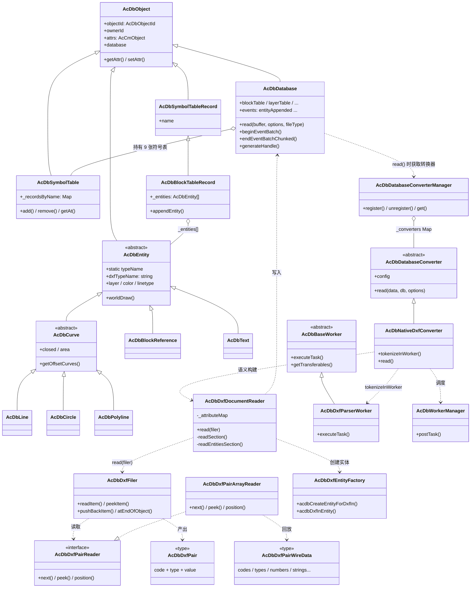
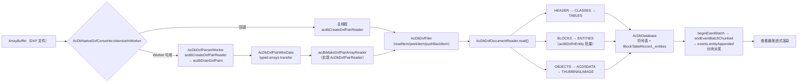

# data-model 解析器类结构详解

> 面向包：`cad-viewer/packages/data-model`（`@hy/data-model`）
> 文档定位：系统梳理 DXF/DWG 解析链路的类结构、职责划分与调用关系。
> 源码基准：当前 `dev_hy` 分支代码；类图与实际源码一致，引用路径均为包内相对路径。
> 关联阅读：[架构图.md](./架构图.md)、[高性能技术分析.md](./高性能技术分析.md)、[性能优化总结.md](../02-性能优化/性能优化总结.md)。

---

## 1. 模块分层总览

`data-model/src/` 按职责分为以下模块，解析器核心集中在 **base / dxf / database / converter**：

```
data-model/src/
├── base/          # 底层基础设施：AcDbObject、DXF pair、Filer、PairReader、Worker 线格式
├── database/      # 数据库：AcDbDatabase、符号表体系、转换器管理、事务
├── dxf/           # DXF 解析管线：DocumentReader、EntityFactory、HeaderReader、NativeDxfConverter
├── converter/     # Worker 抽象、批量处理、Regenerator
├── entity/        # 实体类层次（30+ 实体类型 + 尺寸标注）
├── object/        # 非实体对象：字典、布局、组、栅格图像定义等
├── acis/          # ACIS（3DSOLID 线框）解码
├── ly/            # 图层过滤器（布尔表达式、分组、持久化）
└── misc/          # 辅助：编码、单位、图案、对象迭代器、内存估算等
```

解析链路的"词法 → 语法 → 语义"三段式划分：

| 阶段 | 位置 | 职责 |
| --- | --- | --- |
| 词法解析（tokenize） | `base/AcDbDxfPairReader*` | 字节流 → 类型化组码对（`AcDbDxfPair`） |
| 流式读取（filing） | `base/AcDbDxfFiler` | pair 流 → `readItem/peekItem/pushBackItem` 接口 |
| 语义构建（semantic build） | `dxf/AcDbDxfDocumentReader` 等 | pair 流 → `AcDbDatabase` 对象图（表/实体/属性链接） |

---

## 2. 核心类继承关系总图



---

## 3. 对象根基：AcDbObject

文件：`src/base/AcDbObject.ts`

```typescript
export type AcDbObjectId = string                    // objectId 为字符串句柄
export const TEMP_OBJECT_ID_PREFIX = 'TEMP_'         // 临时对象前缀

export class AcDbObject<ATTRS extends AcDbObjectAttrs = AcDbObjectAttrs> {
  private _database?: AcDbDatabase
  private _attrs: AcCmObject<ATTRS>                  // 属性存储
  private _xDataMap: Map<string, AcDbResultBuffer>   // XData 扩展数据
}
```

关键设计：

1. **属性系统**：所有属性（objectId、ownerId、实体几何属性等）统一存放在 `_attrs`（`AcCmObject`，来自 `@hy/common`），通过 `getAttr()/setAttr()/attrs` 访问。
2. **objectId 生成**（构造期）：
   - 已绑定数据库 → `this._database.generateHandle()`（真实十六进制句柄）；
   - 未绑定 → `generateTemporaryHandle()`，即 `TEMP_` + `uid()`，对象加入数据库时换发真实句柄。
3. **XData**：`_xDataMap` 按 AppName 存储 `AcDbResultBuffer` 链（TypedValue 序列）。
4. **工作数据库机制**：
   - `acdbSetHostApplicationServicesProvider()` 注册 provider；
   - `acdbAssignWorkingDatabase(db)` 在 `read()` 期间赋值工作数据库；
   - `acdbGetWorkingDatabase()` 供未绑定对象/导入路径回退使用。
   - 未设置 provider 时 `acdbAssignWorkingDatabase` 是 no-op，保证模块未加载时安全。

---

## 4. 实体体系

### 4.1 AcDbEntity（抽象实体基类）

文件：`src/entity/AcDbEntity.ts`

```typescript
export abstract class AcDbEntity extends AcDbObject {
  static typeName: string = 'Entity'
  private _layer?: string          // 未显式赋值时回退 database.clayer ?? '0'
  private _color?: AcCmColor
  private _lineType?: string
  private _lineWeight?: AcGiLineWeight
  private _linetypeScale?: number
  private _visibility: boolean = true
  private _transparency: AcCmTransparency
  private _transparencySet: boolean
  private _dxfPaperSpace: boolean  // DXF 组码 67 图纸空间标志

  get type() { return (this.constructor as typeof AcDbEntity).typeName }
  abstract get dxfTypeName(): string   // 导出用 DXF 类型名（LINE/INSERT/DIMENSION...）
}
```

- 每个具体实体类**必须显式声明 `dxfTypeName`**，使 DXF 导出契约局部于实体实现，不由基类推断。
- **组合线型缓存**：模块级 `WeakMap<AcDbLinetypeTableRecord, CachedComposedLineStyles>` 缓存 `lineStyle` 组合结果（按 record 的 linetypeVersion 失效）。`lineStyle` 每次实体 draw 都会访问，缓存避免大图上分配数百万短命对象。

### 4.2 AcDbCurve（抽象曲线基类）

文件：`src/entity/AcDbCurve.ts`

```typescript
export abstract class AcDbCurve extends AcDbEntity {
  static override typeName: string = 'Curve'
  abstract get closed(): boolean
  abstract get area(): number
  abstract getOffsetCurves(offsetDist: number): AcDbCurve[]
  getOffsetSideAtPoint(_point: AcGePoint3dLike): 1 | -1 { return 1 }  // 默认实现
}
```

### 4.3 实体类层次（完整）

```
AcDbEntity (abstract)
├── AcDbCurve (abstract)
│   ├── AcDbLine / AcDbCircle / AcDbArc / AcDbEllipse / AcDbSpline
│   ├── AcDbPolyline (LWPOLYLINE)
│   ├── AcDb2dPolyline / AcDb3dPolyline
│   ├── AcDbRay / AcDbXline
│   ├── AcDbLeader / AcDbTrace
│   ├── AcDbPolygonMesh / AcDbPolyFaceMesh
│   └── AcDbCustomEntity (abstract, 插件扩展点) → AcDbRoadway（巷道实体）
├── AcDbText → AcDbAttribute / AcDbAttributeDefinition
├── AcDbMText / AcDbPoint / AcDbShape / AcDbFcf (TOLERANCE)
├── AcDbBlockReference → AcDbTable (ACAD_TABLE)
├── AcDbFrame (abstract) → AcDbOleFrame → AcDbOle2Frame
├── AcDbRasterImage → AcDbWipeout
├── AcDbHatch / AcDbMLeader / AcDbMLine / AcDb3dSolid / AcDbFace / AcDbViewport
├── AcDbProxyEntity
└── AcDbDimension (abstract)
    ├── AcDbAlignedDimension → AcDbRotatedDimension
    ├── AcDbRadialDimension / AcDbDiametricDimension
    ├── AcDb3PointAngularDimension / AcDbArcDimension / AcDbOrdinateDimension
```

> 自定义实体扩展点：`AcDbCustomEntityRegistry` + `acdbRegisterCustomEntity()` 允许插件注册新实体类型（如 `AcDbRoadway`），工厂默认分支会解析到注册表，无需改工厂 switch。

---

## 5. 词法层：pair 流

### 5.1 AcDbDxfPair（类型化组码对）

文件：`src/base/AcDbDxfPair.ts`

```typescript
export type AcDbDxfPair =
  | { code: number; type: 'string'; value: string }
  | { code: number; type: 'int'; value: number }
  | { code: number; type: 'long'; value: number | bigint }
  | { code: number; type: 'double'; value: number }
  | { code: number; type: 'bool'; value: boolean }
  | { code: number; type: 'handle'; value: string }
  | { code: number; type: 'binary'; value: Uint8Array }
```

7 种值类型由 `src/base/AcDbDxfGroupCodeTypes.ts` 的 `acdbDxfValueType(code)` 按组码区间映射（如 999 → comment 直接过滤、5 → handle、0–9 → string、10–59 → double 等）；`acdbDxfIsInt32Code(code)` 判断二进制 DXF 中 int 是 int16 还是 int32。

### 5.2 AcDbDxfPairReader（词法解析器接口）

文件：`src/base/AcDbDxfPairReader.ts`

```typescript
export interface AcDbDxfPairReader {
  readonly kind: 'ascii' | 'binary'
  next(): AcDbDxfPair | undefined
  peek(): AcDbDxfPair | undefined
  position(): { line?: number; byteOffset: number }
}
```

关键约束与实现：

- **接口契约**：注释明确"实现不得把整个文件物化为 `string[]`"；999 注释对在 reader 层直接过滤，`next/peek` 均不返回。
- 工厂函数：
  - `acdbCreateDxfPairReader(data)`——真实文件入口：二进制魔数检测后，ASCII DXF 一律按 UTF-8 字节 reader 解析（不再做编码探测/回退）。
  - `acdbMakeUtf8AsciiDxfPairReader(bytes)`——UTF-8/ASCII 字节级 reader；组码与数值行不经过 `TextDecoder`。
  - `acdbMakeAsciiDxfPairReader(text)`——已解码字符串的兼容入口：先 UTF-8 编码为字节，再交给字节 reader。
  - `acdbMakeBinaryDxfPairReader(data)`——二进制 DXF reader；字符串按 UTF-8 解码，与 binary 写出端一致。
  - `acdbIsBinaryDxf(data)`——22 字节魔数（`AutoCAD Binary DXF\r\n` + `0x1A 0x00`）检测。
- 热路径优化：
  - `acdbReadDxfCodeFromBytes`：字节级组码扫描；
  - `acdbParseDoubleSpan` / `acdbParseIntSpan` / `acdbParseLongSpan`：字节 span 级数值解析（在可证明精确的域内零分配，越域回退 decode+`Number`/`parseInt`）；
  - `acdbDecodeUtf8Span`：纯 ASCII 值走 `String.fromCharCode` 零 `TextDecoder` 快路径，含多字节 UTF-8 时才调用 `TextDecoder('utf-8')`。

---

## 6. 流式读写层：AcDbDxfFiler

文件：`src/base/AcDbDxfFiler.ts`

```typescript
export type AcDbDxfFilerMode = 'read' | 'write'
export enum AcDbDxfFilerStatus { Ok, EndOfFile, EndOfObject, ... }

export class AcDbDxfFiler {
  private _reader?: AcDbDxfPairReader   // 读模式的数据源
  private _pushed: AcDbDxfPair[]        // pushBack 栈（LIFO，支持嵌套）
  private _lastRead: AcDbDxfPair | undefined
  private _handleMap: Map<string, string>  // 写模式句柄映射
  // 写模式：_lines: string[] / _binaryChunks: Uint8Array[] 累积输出
}
```

职责与 API：

- **读模式**（对 `AcDbDxfPairReader` 的流式封装）：`readItem()`、`peekItem()`、`pushBackItem()`、`atEndOfObject()`、`atSubclassData()`、`atExtendedData`、`atEof`、`skipToEndOfObject()`。
- **写模式**：按 `outputFormat: 'ascii' | 'binary'` 累积经典 DXF 文本或二进制 DXF 字节（二进制以 22 字节魔数开头）。
- 工厂方法：
  - `forReading(reader, options)`——从任意 pair reader 建读 filer；
  - `fromBuffer(data, options)`——从 DXF 字节建读 filer（自动 ASCII/binary）；
  - `fromString(text, options)`——从已解码字符串建读 filer。
- `pushBackItem` 依赖对象同一性检测（消费方同步用完 pair 是不变量），这也是 pair 池化实验（M2-3）最终放弃的原因之一——V8 新生代 bump 分配极快，复用可变对象反而更慢且破坏对象形状。

---

## 7. Worker 词法解析：线格式与回放

### 7.1 AcDbDxfPairWireData（SoA 线格式）

文件：`src/base/AcDbDxfPairWire.ts`

```typescript
export interface AcDbDxfPairWireData {
  kind: 'ascii' | 'binary'
  count: number
  codes: Int32Array          // 每 pair 的组码
  types: Uint8Array          // 类型标签：String=0 Int=1 Double=2 Long=3 Bool=4 Handle=5 Binary=6
  numbers: Float64Array      // int/double/bool(0|1) 值，按 pair 顺序
  longs: string[]            // long 值十进制字符串（wire 上保持 bigint 精确）
  strings: string[]          // string/handle 去重表
  stringIndices: Int32Array  // 每个 string/handle pair 在 strings 表中的下标
  binaries: Uint8Array[]     // binary 值侧数组
}
```

设计要点：

- **零拷贝 transfer**：`acdbDxfPairWireTransferables(wire)` 返回所有 typed array 的 transfer 列表，`postMessage` 时转移所有权；
- **字符串去重**：DXF 大量重复子类标记/图层名，去重表避免逐 pair 传输；
- **稀有值走侧数组**：long（含 bigint）/binary 极少出现，放侧数组使常见数值路径保持平坦；
- 函数：`acdbDrainDxfPairs(reader, options)`（worker 内抽干，onProgress 最多 ~50 次）、`acdbMakeDxfPairArrayReader(wire)`（主线程回放，实现同一 `AcDbDxfPairReader` 接口）。

### 7.2 AcDbDxfPairArrayReader（回放 reader）

文件：`src/dxf/AcDbDxfPairArrayReader.ts`

```typescript
export class AcDbDxfPairArrayReader implements AcDbDxfPairReader {
  readonly kind: 'ascii' | 'binary' = 'ascii'
  private _index = 0
  constructor(private readonly _pairs: readonly AcDbDxfPair[]) {}
  // next() / peek() / position() —— 纯数组下标游标
}
```

辅助函数：
- `acdbTypedValueToDxfPair(item)`——`AcDbTypedValue` → `AcDbDxfPair`；
- `acdbDrainDxfObjectPairs(filer)`——把当前对象 drain 为 pair 数组（直到 code 0，排除 XData），用于 DIMENSION 子类选择等单对象回放。

---

## 8. 语义构建层

### 8.1 AcDbDxfDocumentReader（单遍流式文档读取器）

文件：`src/dxf/AcDbDxfDocumentReader.ts`

```typescript
export class AcDbDxfDocumentReader {
  private _unknownEntityCount = 0
  private _unknownObjectCount = 0
  private readonly _attributeMap = new Map<AcDbObjectId, AcDbAttribute[]>()  // ATTRIB 等待所属 INSERT
  private readonly _yieldGate: AcCmUiYieldGate                                // 时间预算让门

  constructor(db: AcDbDatabase, options: AcDbDxfDocumentReaderOptions) {}
  async read(filer: AcDbDxfFiler): Promise<AcDbDxfDocumentReaderResult>
}
```

**顶层循环**（`read()`）：
1. `readItem()` 逐个读 pair，只处理 code 0（对象类型名），大写字面量比较；
2. 遇到 `EOF` 退出；遇到 `SECTION` → 读 code 2 的节名 → `readSection()`；
3. 结束后 `flushRemainingAttributes()`（把遗留 ATTRIB 挂到所属 INSERT）。

**节分派**（`readSection()`）：

| SECTION | 处理函数 | 说明 |
| --- | --- | --- |
| HEADER | `acdbDxfInHeader(filer, db)` | 系统变量、`$HANDSEED` 等 |
| CLASSES | `readClassesSection()` | DXF 类定义 → `AcDbClass` |
| TABLES | `readTablesSection()` | 各符号表记录 |
| BLOCKS | `readBlocksSection()` | 块定义（含 INSERT 引用） |
| ENTITIES | `readEntitiesSection()` | 实体流（见下） |
| OBJECTS | `AcDbDxfObjectsReader.read(filer)` | 字典 / GROUP / 布局等 |
| ACDSDATA | `applyAcdsDataToSolids()` | 把 ASM_Data SAB 载荷按句柄挂到 `AcDb3dSolid` |
| THUMBNAILIMAGE | `readThumbnailImageSection()` | 310 二进制块 → `db.thumbnailImage` |
| default | `skipUntilEndSec()` | 未知节跳到 ENDSEC |

**实体流处理**（`readEntitiesSection()`）：
- `batchSize = max(1, entityBatchSize ?? 200)`（转换器实际传入 `minimumChunkSize`，默认 10）；
- `peekItem()` 识别 code 0；`ENDSEC` 结束；
- `SEQEND` 跳过（闭合 INSERT+ATTRIB / POLYLINE 顶点流，非实体）；
- 调用 `acdbDxfInEntity(filer, name)` 创建实体，未知类型 `skipToEndOfObject()` 并计数；
- `acceptEntity(entity, owner)` 写入目标 `BlockTableRecord`（owner 由 `resolveEntityOwner` 解析，如 INSERT 内的 ATTRIB 归属块引用）；
- 每处理 `batchSize` 个实体后 `yieldAndReportProgress()`（时间预算 + 进度上报）。

**ATTRIB 两段式处理**：`ATTRIB` 先存入 `_attributeMap`（按所属 INSERT 的 objectId 分组），INSERT 完成后再 `syncAttributeDatabases()`，保证属性数据库链接正确。

### 8.2 AcDbDxfEntityFactory（实体工厂）

文件：`src/dxf/AcDbDxfEntityFactory.ts`

```typescript
export function acdbCreateEntityForDxfIn(typeName: string): AcDbEntity | null
export function acdbDxfInEntity(filer: AcDbDxfFiler, name: string): AcDbEntity | null
```

- `acdbCreateEntityForDxfIn()`：switch 匹配 DXF 类型名 → `new AcDbXxx()`，覆盖 LINE/CIRCLE/ARC/ELLIPSE/SPLINE/LWPOLYLINE/INSERT/TEXT/MTEXT/ATTDEF/ATTRIB/HATCH/MLINE/MULTILEADER/ACAD_TABLE/3DSOLID/ACAD_PROXY_ENTITY 等 30+ 种；
- **默认分支**：`acdbCreateCustomEntity(type)`——插件自定义实体注册表，新增实体类型无需改 switch；
- 组合实体由独立 assembler 处理：`AcDbDxfPolylineAssembler`（POLYLINE + VERTEX + SEQEND）、`AcDbDxfDimensionAssembler`（DIMENSION 子类选择）。

### 8.3 其他节读取器

| 文件 | 入口 | 职责 |
| --- | --- | --- |
| `src/dxf/AcDbDxfHeaderReader.ts` | `acdbDxfInHeader(filer, db)` | HEADER 系统变量（含 `$HANDSEED` → `initializeHandleSeed`） |
| `src/dxf/AcDbDxfObjectsReader.ts` | `AcDbDxfObjectsReader` | OBJECTS 节：字典/XRecord/图层过滤器持久化 |
| `src/dxf/AcDbDxfAcdsDataReader.ts` | `acdbDxfInAcdsData(filer)` | ACDSDATA：按 owner 句柄收集 SAB 二进制 |
| `src/dxf/AcDbDxfVersionCaps.ts` | — | DXF 版本能力位（AC1009→AC1032+） |

---

## 9. 转换器体系

### 9.1 AcDbDatabaseConverterManager（单例管理器）

文件：`src/database/AcDbDatabaseConverterManager.ts`

```typescript
export enum AcDbFileType { DXF = 'dxf', DWG = 'dwg' }
export type AcDbConverterType = AcDbFileType | string   // 支持自定义类型标识

export class AcDbDatabaseConverterManager {
  private static _instance?: AcDbDatabaseConverterManager
  private _converters: Map<AcDbConverterType, AcDbDatabaseConverter>
  public readonly events = { registered, unregistered }
  static get instance(): AcDbDatabaseConverterManager
}
```

- **DXF 默认注册**：私有构造函数中 `register(DXF, new AcDbNativeDxfConverter())`，开箱即用；再次 register 可替换实现（如 GPL 的 dxf-json-converter）。
- **DWG 无默认**：调用方必须显式注册（如 `AcDbLibreDwgConverter`），未注册时 `AcDbDatabase.read()` 抛错。

### 9.2 AcDbDatabaseConverter（抽象转换器）

文件：`src/database/AcDbDatabaseConverter.ts`

```typescript
export abstract class AcDbDatabaseConverter<TModel = unknown> {
  progress?: AcDbConversionProgressCallback
  readonly config: AcDbDatabaseConverterConfig   // useWorker 默认 true、timeout 默认 30000、convertByEntityType 默认 false
  abstract read(data: ArrayBuffer, db: AcDbDatabase, options): Promise<void>
}
```

基类 `read()` 编排 parse → 表/实体处理 → 进度回调的通用流程；子类（如 `AcDbLibreDwgConverter`）复用该流程。
另有 `AcDbRegenerator`（`src/converter/AcDbRegenerator.ts`）继承转换器但只"再生"已有数据库，用 `AcDbBatchProcessing` 分批重处理实体。

### 9.3 AcDbNativeDxfConverter（原生 DXF 转换器）

文件：`src/dxf/AcDbNativeDxfConverter.ts`

进度常量（权重反映实际成本分布）：

```
START=0 → PARSE_START=1 → TOKENIZE_END=10 → PARSE_END=18 → ENTITY_START=20 → ENTITY_END=98 → END=100
```

`read(data, db, options)` 流程：

1. 发射 `START` → `PARSE/START` 进度，`await accmYieldForPaint()` 让 overlay 先出帧；
2. `tokenizeInWorker(data, emit)`：
   - 可用 → 返回 `AcDbDxfPairWireData`（worker 词法，进度映射 1–10%）；
   - 不可用（Node / bundle 缺失 / 任务失败）→ 返回 null，主线程回退；
3. `db.beginEventBatch()` 抑制 `entityAppended`，避免解析中途 worldDraw；
4. 构造 filer：
   - worker 路径：`AcDbDxfFiler.forReading(acdbMakeDxfPairArrayReader(wire))`，进度单位 = pair 数，构建起点 10%；
   - 回退路径：`AcDbDxfFiler.fromBuffer(data)`，进度单位 = 字节数，构建起点 1%；
5. `new AcDbDxfDocumentReader(db, { entityBatchSize, yieldBudgetMs, onProgress })` 语义构建（10–18%）；
6. `endEventBatchChunked(...)` 分块 flush `entityAppended`（20–98%）；
7. 发射 `END(100)`。

---

## 10. 数据库与符号表

### 10.1 AcDbDatabase

文件：`src/database/AcDbDatabase.ts`

```typescript
export class AcDbDatabase extends AcDbObject {
  // 系统变量私有字段：_version/_clayer/_cecolor/_textstyle/_dimstyle/_extents/_ltscale/...
  public readonly events = {
    dictObjetSet, dictObjectErased,
    entityAppended, entityModified, entityErased,
    layerAppended, layerModified, layerErased,
    openProgress, openFailed
  }
  private _maxHandle: number
  private _maxHandleBig?: bigint     // 超过 MAX_SAFE_INTEGER 后启用
  private _tables: { appIdTable, blockTable, dimStyleTable, linetypeTable,
                     textStyleTable, ucsTable, viewTable, layerTable, viewportTable }
  private _objects: { dictionary, group, imageDefinition, layerFilter, layerIndex,
                      layout, mleaderStyle, mlineStyle, sortentsTable, xrecord }
  transactionManager: AcDbDatabaseTransactionManager
}
```

关键机制：

- **构造**：`objectId = '0'`（数据库自身句柄），默认版本 AC1014，9 张符号表 + 10 个对象字典全部内建；
- **read()**：从 `AcDbDatabaseConverterManager` 取转换器 → `clear()` → `acdbAssignWorkingDatabase(this)` → `converter.read(...)`（带进度回调桥接）→ `ensureDatabaseDefaults()`；失败抛 `AcDbOpenDatabaseError` 并派发 `openFailed`；
- **事件批处理**：`beginEventBatch()` 抑制事件；`endEventBatchChunked()` 在批计数归零时**分块**派发累积的 `entityAppended`（渐进式渲染数据入口）；
- **句柄生成**（`generateHandle()`）：
  ```
  if (_maxHandleBig != null) { ++BigInt → hex }
  if (_maxHandle >= Number.MAX_SAFE_INTEGER) { 切换到 BigInt 后递归 }
  _maxHandle++ → hex
  ```
  配合 `initializeHandleSeed()`（`$HANDSEED` BigInt 感知）修复了 95MB 矿图 16% 卡死问题。

### 10.2 符号表体系

文件：`src/database/AcDbSymbolTable.ts`、`AcDbSymbolTableRecord.ts`

```typescript
export class AcDbSymbolTable<RecordType extends AcDbSymbolTableRecord> extends AcDbObject {
  protected _recordsByName: Map<string, RecordType>   // 按规范化名索引
  protected _unnamedRecords: RecordType[]              // 无名记录（按 objectId 访问）
  constructor(db) {
    super()
    this.database = db
    this.objectId = db.generateHandle()
    this.ownerId = db.objectId        // 符号表归数据库所有
  }
  add(record) / remove(name) / getAt(name) / has(name) / newIterator()
}

export class AcDbSymbolTableRecord<ATTRS> extends AcDbObject<ATTRS> {
  get/set name  // DXF 组码 2
  override setAttr() { this.assertOpenForWrite(); ... }  // ObjectARX 打开写语义
}
```

- `add()` 做事务检查、绑定 database/ownerId、规范化名称入库、事务记录；
- 9 张符号表：BlockTable、LayerTable、LinetypeTable、TextStyleTable、DimStyleTable、UcsTable、ViewTable、ViewportTable、RegAppTable。

### 10.3 AcDbBlockTableRecord（实体容器）

文件：`src/database/AcDbBlockTableRecord.ts`

```typescript
export class AcDbBlockTableRecord extends AcDbSymbolTableRecord<...> {
  static MODEL_SPACE_NAME = '*Model_Space'
  static PAPER_SPACE_NAME_PREFIX = '*Paper_Space'
  private _entities: AcDbEntity[]      // 按插入顺序
  appendEntity(entity: AcDbEntity | AcDbEntity[])
}
```

`appendEntity()` 流程：事务检查 → 绑定 database/ownerId → `ensureEntityStyleDefaults` → `commitObjectHandle` → `resolveEffectiveProperties` → 入 `_entities` → INSERT 同步属性数据库 → 事务记录 → 模型/图纸空间且非记录中时 `notifyEntityAppended()`。
解析完成后全部实体即存放于这些 `BlockTableRecord` 中。

---

## 11. Worker 框架

文件：`src/converter/worker/AcDbBaseWorker.ts`、`AcDbWorkerManager.ts`

```typescript
export abstract class AcDbBaseWorker<TInput, TOutput> {
  protected abstract executeTask(input: TInput, context: AcDbWorkerTaskContext): TOutput
  protected getTransferables?(data: TOutput): Transferable[]   // 可选零拷贝钩子
}

export class AcDbWorkerManager { /* worker 池 + 任务队列 + 超时管理 */ }
export class AcDbWorkerApi { /* 高层 API */ }
```

- **协议**：`{ id, input } → { id, success, data, error, errorCode }`；任务 id = `task_${n}_${timestamp}`；worker 内通过 `context.reportProgress(ratio)` 上报 `{ id, type: 'progress', progress }` 中间进度；
- **零拷贝**：输入为 `ArrayBuffer` 时通过 transfer 列表转移；输出经 `getTransferables()` 钩子转移 typed arrays（DXF pair 流即如此）；
- **超时**：默认 30s，按任务配置；`postMessage` 失败归类 `worker_oom` / `worker_timeout` 错误码；
- **DXF worker 实现**：`src/dxf/AcDbDxfParserWorker.ts`

```typescript
class AcDbDxfParserWorker extends AcDbBaseWorker<ArrayBuffer, AcDbDxfPairWireData> {
  protected executeTask(input, context) {
    const reader = acdbCreateDxfPairReader(input)
    return acdbDrainDxfPairs(reader, {
      totalBytes: input.byteLength,
      onProgress: ratio => context.reportProgress(ratio)
    })
  }
  protected override getTransferables(data) { return acdbDxfPairWireTransferables(data) }
}
new AcDbDxfParserWorker()
```

---

## 12. 解析数据流总览



### 关键数据流不变量

1. **Worker 与主线程行为一致**：worker 只做词法，主线程回放同一 pair 流进入同一 filer/document-reader 管线；表/实体/属性链接/ACDSDATA 语义零改动（单测 `AcDbDxfPairWire.spec.ts` 做 pair 级无损回环断言）。
2. **不做全文件物化**：reader 契约禁止 `string[]` 全量物化；64KiB 分块 `TextDecoder` 流式解码。
3. **主线程不 idle**：`AcCmUiYieldGate` 时间预算 + `entityBatchSize` 分批让出，保证大文件打开时页面可响应。

---

## 13. 类与性能优化的对应关系

| 类/文件 | 性能优化点 |
| --- | --- |
| `base/AcDbDxfPairReader.ts` | M1/M2 零分配热路径（char 扫描、span 数值解析、UTF-8 嗅探） |
| `base/AcDbDxfFiler.ts` | 直接返回 pair 对象，去掉 `pairToTypedValue` 包装 |
| `base/AcDbDxfPairWire.ts` | SoA typed array 零拷贝 transfer + 字符串去重 |
| `dxf/AcDbDxfParserWorker.ts` | DXF 词法解析移入 Web Worker |
| `dxf/AcDbNativeDxfConverter.ts` | 默认 useWorker + 自动回退 + 分段进度 + 事件批处理 |
| `dxf/AcDbDxfDocumentReader.ts` | entityBatchSize 分批 + 时间预算让门 + 进度上报 |
| `database/AcDbDatabase.ts` | `$HANDSEED` BigInt 切换（16% 卡死修复）、事件分块 flush |
| `entity/AcDbEntity.ts` | 组合线型 WeakMap 缓存（减少 worldDraw 分配） |
| `entity/AcDbFace.ts` / `AcDb3dSolid.ts` / acis/* | WCS 坐标 Float32Array → Float64Array（构建期原点平移前置条件） |

---

## 14. 相关文档索引

- [架构图.md](./架构图.md)——工作区总体架构、解析/渲染管线、性能基准工具链
- [高性能技术分析.md](./高性能技术分析.md)——Worker/WASM/内存管理技术选型
- [性能优化总结.md](../02-性能优化/性能优化总结.md)——M0–M2 + 专项修复全景与基准数据
- [优化计划.md](../02-性能优化/优化计划.md)——M1–M5 里程碑实施细节
- [功能插件开发标准.md](../04-开发规范/功能插件开发标准.md)——自定义实体/插件扩展规范
- `cad-viewer/packages/data-model/README.md`——包级 API 概览与使用示例
