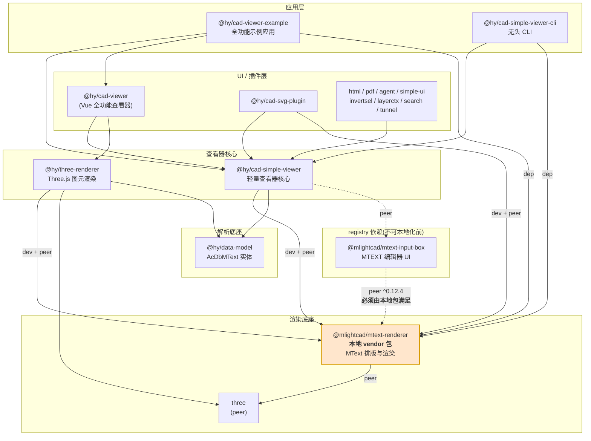
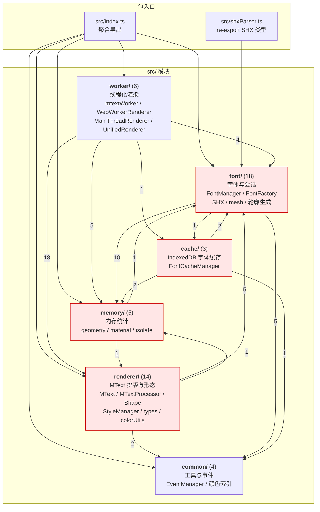
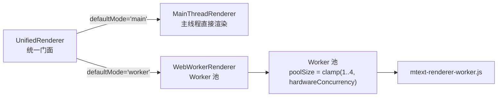
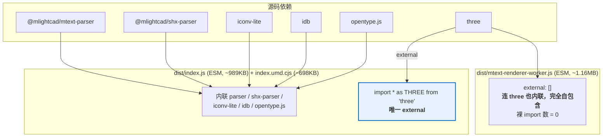
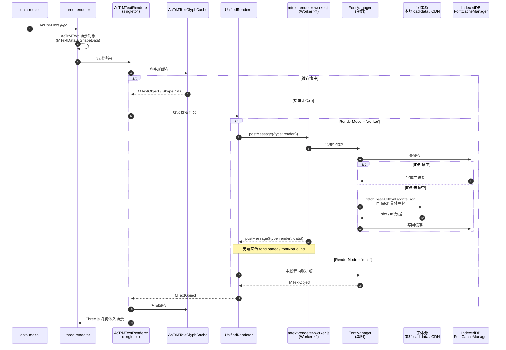
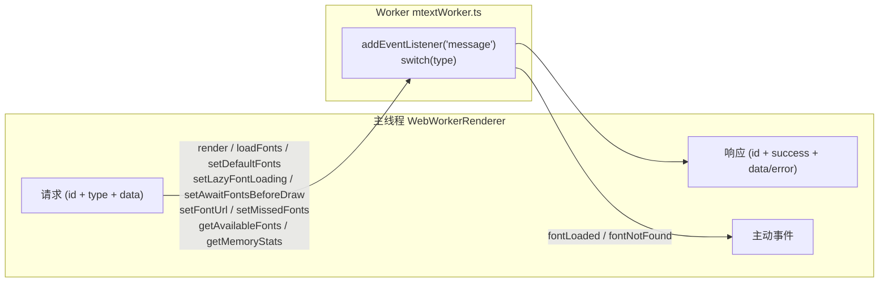
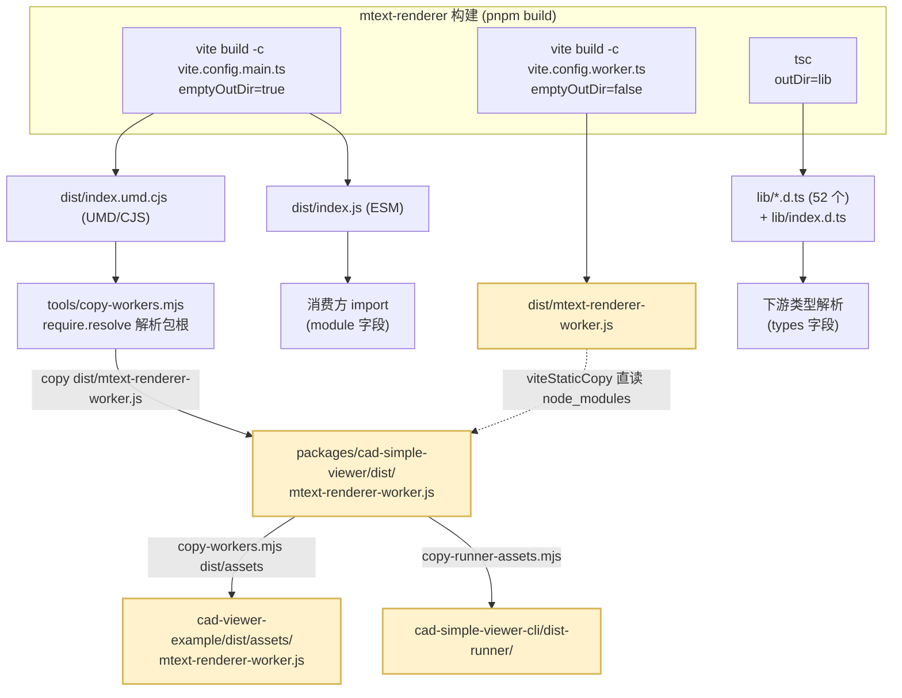
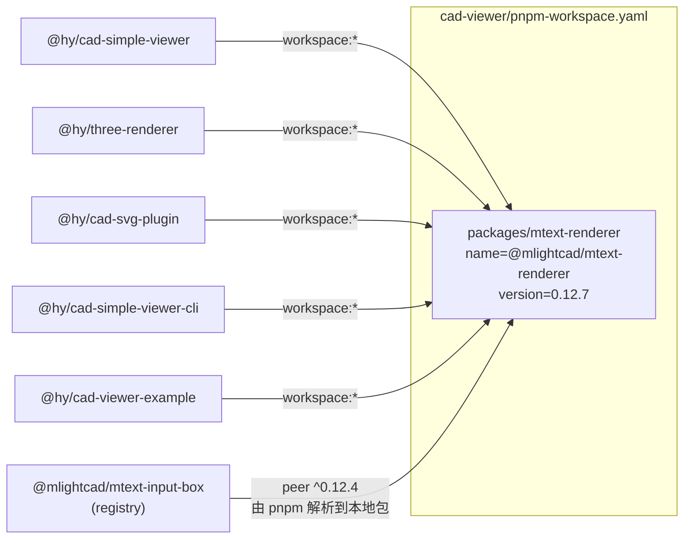

# mtext-renderer 依赖流程图

> 本文档说明 `@mlightcad/mtext-renderer` 是什么、在本工作区中的依赖位置、
> 包内模块结构、运行时渲染/字体链路，以及构建产物与 worker 资产流转。
> 图表基于当前代码实现绘制（2026-09，vendored 自上游 `f7e7b69` / 0.12.7）。
>
> 本地化改造的背景与约束见 [`../../cad-viewer/packages/mtext-renderer/README.md`](../../cad-viewer/packages/mtext-renderer/README.md)。

---

## 1. mtext-renderer 是什么

**一句话**：把 AutoCAD 的 **MTEXT 实体**（带格式的成段文字）解析、排版并渲染成
Three.js 几何体的底座库。它是本项目里「**文字**」这条渲染链路的核心，
与 `three-renderer`（负责图元/批处理/相机）并列，而不是它的子模块。

### 1.1 它解决什么问题

DXF 里的 `TEXT` 只是一行简单文字，而 `MTEXT` 是一个**富文本容器**，
渲染它需要一整套排版引擎：

| 能力 | 说明 |
| --- | --- |
| 内联格式控制码 | `\P` 换行、`\f`/`\F` 字体、`\H` 字高、`\W` 宽度因子、`\A` 对齐、`\C` 颜色、`\S` 堆叠分数 |
| 多字体混排 | 单个 MTEXT 内可切换 SHX / TrueType 字体，逐字符选字体 |
| SHX 字体解析 | 读写 AutoCAD 形文件（含 bigfont 大字体、符号字体、`%%d` 等控制码） |
| TrueType 轮廓 | 用 opentype.js 解析 ttf，转成可渲染轮廓 |
| CJK 断行与对齐 | 中文按字宽换行、与拉丁字母共基线的混排对齐 |
| 字形几何 | 生成 char box / 行布局 / 轮廓 Shape，并缓存 |
| 后台线程 | 排版与字形生成可放进 Web Worker 池，避免阻塞主线程 |

### 1.2 它不是什么

- **不是图元渲染器**：不负责线/圆/弧/填充、批处理、相机、拾取——那是 `three-renderer`。
- **不是解析器**：DXF 词法/语法在 `data-model`；MTEXT 内容语法在 `@mlightcad/mtext-parser`（被它内联打包）。
- **不持有图纸状态**：无 AcDb 数据库概念，只吃 `MTextData` 吐 `MTextObject`/`ShapeData`。

### 1.3 对外暴露的 API 面（消费者实际用到的）

| 类别 | 符号 |
| --- | --- |
| 字体管理 | `FontManager`（单例）、`DefaultFontLoader`、`FontInfo`、`FontLoadStatus`、`FontType`、`DefaultFontsPreset` |
| SHX | `ShxParserFont`、`ShxFontData`（re-export 自 `@mlightcad/shx-parser`） |
| 渲染 | `UnifiedRenderer`、`RenderMode`、`MTextObject`、`MTextData`、`ShapeData`、`StyleManager`、`TextStyle` |
| 样式/颜色 | `ColorSettings`、`createDefaultColorSettings`、`MTextColor`、`MTextAttachmentPoint` |
| 诊断 | `MemoryUsageReport`、`FontMemoryStats` |

---

## 2. 工作区依赖分层：mtext-renderer 的位置

### 2.1 依赖声明方式汇总

| 包 | 声明位置 | 值 |
| --- | --- | --- |
| `@hy/cad-simple-viewer` | `devDependencies` + `peerDependencies` | `workspace:*` |
| `@hy/three-renderer` | `devDependencies` + `peerDependencies` | `workspace:*` |
| `@hy/cad-svg-plugin` | `devDependencies` + `peerDependencies` | `workspace:*` |
| `@hy/cad-simple-viewer-cli` | `dependencies` | `workspace:*` |
| `@hy/cad-viewer-example` | `dependencies` | `workspace:*` |
| `@mlightcad/mtext-input-box` | `peerDependencies`（registry 包） | `^0.12.4` → 由本地包满足 |

> **关键约束**：`mtext-input-box` 是从 npm 安装的 registry 包，它在**运行时**从
> `@mlightcad/mtext-renderer` 导入类值（`MTextColor`、`MText`、`MTextContext`、
> `UnifiedRenderer`）与枚举（`MTextAttachmentPoint`、`MTextFlowDirection`、
> `MTextLineAlignment`、`MTextParagraphAlignment`）。
> 因此本地包**必须保留原名 `@mlightcad/mtext-renderer`**，且 `version` 必须落在
> `^0.12.4` 区间内，否则 pnpm 会为这条 peer 边再装一份 registry 副本，
> 导致双实例（`instanceof` 失效 + 约 1MB 重复 bundle）。

---

## 3. 包内模块依赖图

`src/` 按职责分为 6 个子目录 + 2 个根文件（共 52 个 `.ts`）。
下图的边是**由实际 `import` 语句统计得出**，不是设计意图。

### 3.1 模块环依赖提示

统计结果里有三处**双向依赖**，是真实的耦合（非笔误）：

| 环 | 边 | 说明 |
| --- | --- | --- |
| `renderer ↔ memory` | `renderer→memory(1)` / `memory→renderer(1)` | 内存统计需要枚举 StyleManager 材质，而渲染器要上报统计 |
| `font ↔ memory` | `font→memory(10)` / `memory→font(1)` | 字体占了大头内存估算 |
| `cache ↔ font` | `cache→font(2)` / `font→cache(1)` | 字体缓存读写与字体对象互相引用 |

> 这意味着**不能**靠目录边界做增量构建/裁剪；改动 `font/` 会牵动
> `renderer/`、`worker/`、`cache/`、`memory/` 四个目录。

### 3.2 渲染入口的双模式

> 注意默认值不同：库自身 `UnifiedRenderer` 默认 `'main'`，
> 而 `three-renderer/AcTrMTextRenderer` 初始化时取 `mode = this._renderMode ?? 'worker'`，
> **在工作区里默认走 Worker**。

---

## 4. 对外部依赖的打包策略

mtext-renderer 构建时把绝大多数依赖**内联**进产物，只把 `three` 留作 peer。
这是消费方「装一个包就能跑」的原因，也是它体积大的原因。

**设计要点**：`rollupOptions.external: ['three']` 是**精确匹配**，Rollup 用
`ids.has(id)` 比较，所以 `three/examples/jsm/**` 子路径**不会**被 external，
而是被打进 bundle（上游刻意如此，本地化时保留了该行为）。
Worker 产物 `external: []` + `inlineDynamicImports: true` 保证它是**单文件零依赖**，
可以被当作静态资源直接 `new Worker(url, { type: 'module' })` 加载。

---

## 5. 运行时：一条 MTEXT 的绘制链路

> 消费者侧 `AcTrFontLoader` 实现字体装载接口，`AcApDocManager` 把
> `resolveCadDataBaseUrl()` 解析出的地址同时注入 `_fontLoader.baseUrl` 与
> `FontManager.instance.baseUrl`（见 `AcApDocManager.ts:555-557`），
> 字体仓库根拼成 `<baseUrl>/fonts/fonts.json` 与 `<baseUrl>/fonts/<file>`。

---

## 6. Worker 消息协议

Worker 采用「**请求/响应 + 主动事件**」双通道，用 `id` 关联请求与响应。

| 方向 | 消息类型 |
| --- | --- |
| 主 → Worker | `render`、`loadFonts`、`setDefaultFonts`、`setLazyFontLoading`、`setAwaitFontsBeforeDraw`、`setFontUrl`、`setMissedFonts`、`getAvailableFonts`、`getMemoryStats` |
| Worker → 主（响应） | 上述同名 + `success`/`data`/`error` |
| Worker → 主（主动） | `fontLoaded`、`fontNotFound`、`error` |

> 跨 `postMessage` 会破坏 `MTextColor` 原型，Worker 侧用 `normalizeColorSettings`
> 复活实例——这是「颜色对象不能裸传」的已知坑。

---

## 7. 构建产物与 worker 资产流转

**文件名是契约**：`dist/mtext-renderer-worker.js` 这个名字被硬编码在
`tools/worker-assets.mjs`，并由以下 4 条独立路径引用，改名需同步全部：

1. `tools/copy-workers.mjs`（`<pkgRoot>/dist/mtext-renderer-worker.js`）
2. `packages/cad-simple-viewer/vite.config.ts`（viteStaticCopy 直读 node_modules）
3. `packages/cad-simple-viewer-cli/scripts/copy-runner-assets.mjs`
4. `packages/cad-viewer-example/vite.config.ts`（从 cad-simple-viewer/dist 二次拷贝）

---

## 8. 本地化后的解析结果（单实例证明）

验证结论（`node_modules/.pnpm` 中 mtext-renderer 实例数 = **1**）：

| 检查项 | 结果 |
| --- | --- |
| 5 个消费者 → 本地包 | ✅ 全部 `link:../mtext-renderer` |
| `mtext-input-box` peer → 本地包 | ✅ 同一 realpath |
| `.pnpm` 中副本数 | ✅ 1 |
| worker 资产跨链路一致 | ✅ 字节相同 |

> **不要做的事**：把本包改名（如 `@hy/mtext-renderer`）或把 `version` 抬出
> `^0.12.4`。两者都会让 `mtext-input-box` 的 peer 边从 registry 再装一份，
> 造成双实例。

---

## 9. 相关文档

- 本地化改造记录：[`packages/mtext-renderer/README.md`](../../cad-viewer/packages/mtext-renderer/README.md)
- 工作区总体架构：[架构图.md](./架构图.md)
- 渲染侧类结构：[cad-viewer类结构详解.md](./cad-viewer类结构详解.md)
- 字体资源本地化：[cad-data本地资源化改造.md](../03-缺陷修复与功能改造/cad-data本地资源化改造.md)
