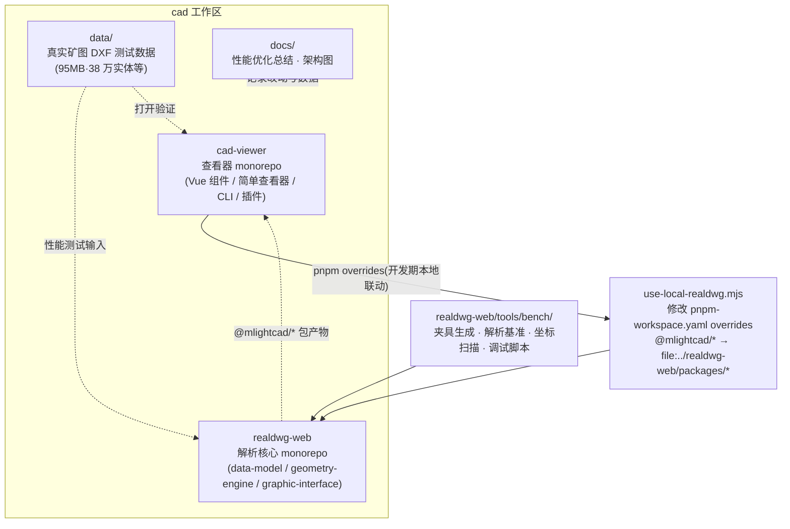
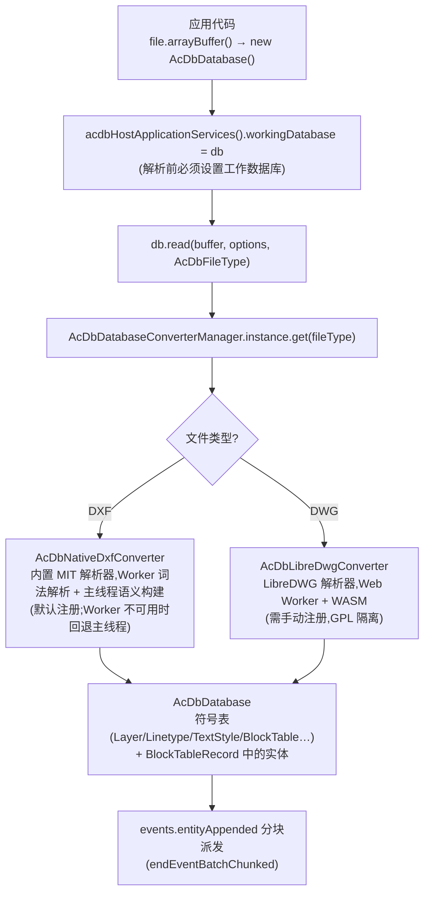
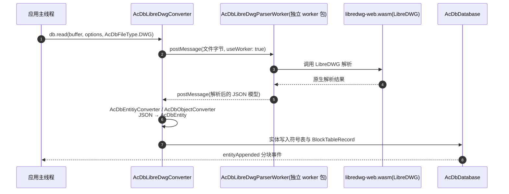
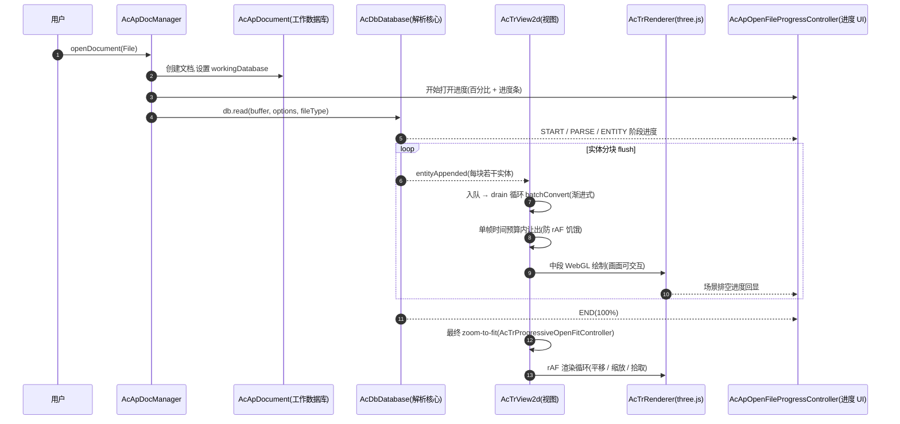
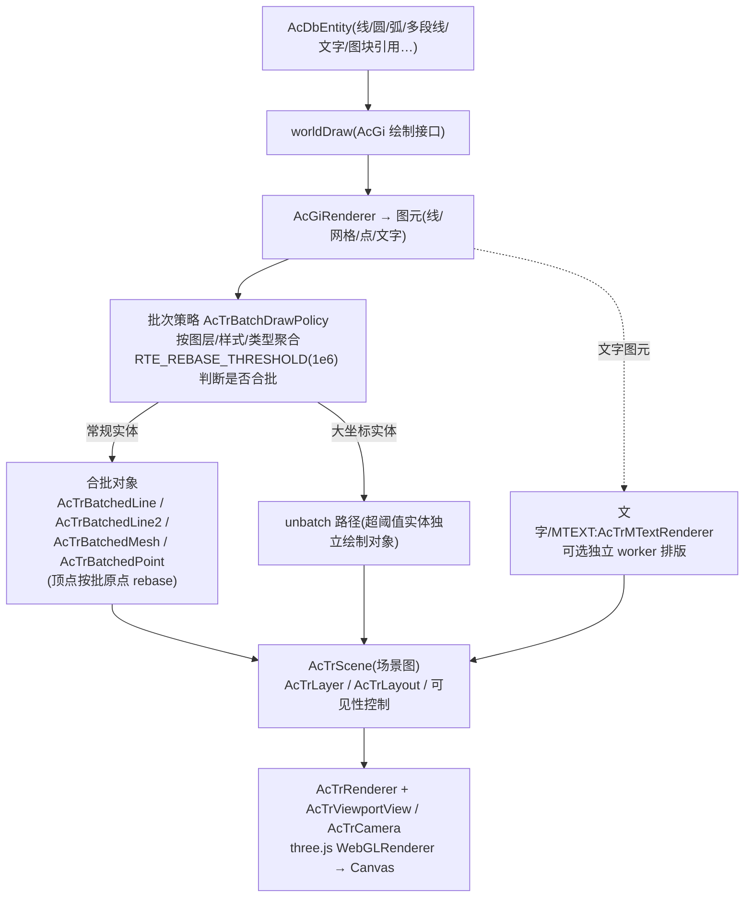
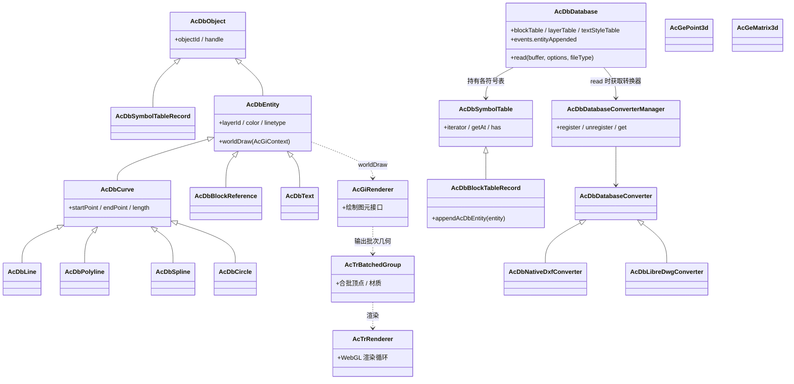
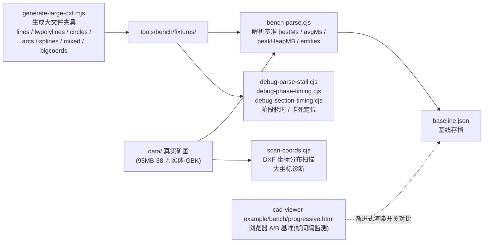
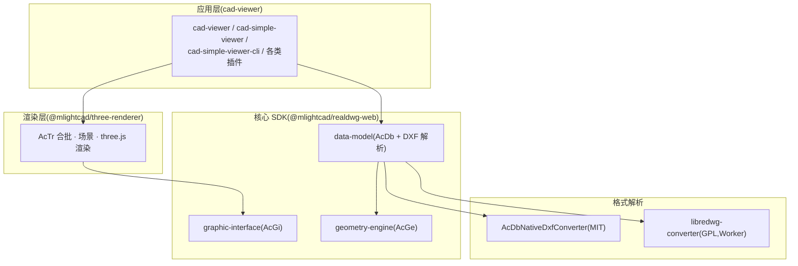

# 项目流程图与架构图

> 本文档描述本工作区(`cad-viewer` + `realdwg-web` 联合开发)的整体架构与关键流程,
> 图表基于当前代码实现绘制(2026-08)。性能优化背景与改动细节见
> [性能优化总结.md](../02-性能优化/性能优化总结.md)。

---

## 1. 工作区总体架构

- **cad-viewer**:纯浏览器 DWG/DXF 查看器与编辑器,依赖 `@mlightcad/*` 包做解析。
- **realdwg-web**:解析核心,仿 AutoCAD ObjectARX API,输出 `data-model` 等 npm 包。
- 开发期通过 `use-local-realdwg.mjs` 把 cad-viewer 的依赖指向本地 realdwg-web
  构建产物,实现两库联动调试;**发布前必须 `--off` 还原**。

---

## 2. 文件解析总体流程(DXF / DWG)

**要点**

- DXF 转换器默认注册,DWG 转换器需先
  `AcDbDatabaseConverterManager.instance.register(AcDbFileType.DWG, ...)`。
- 解析完成后实体存放于 `AcDbBlockTableRecord`(模型空间/图纸空间),
  并通过 `entityAppended` 事件分块通知查看器,是渐进式渲染的数据入口。

---

## 3. DXF 解析管线(Worker 词法解析 + 主线程语义构建)

```mermaid
flowchart LR
    BUF["ArrayBuffer<br/>(含 GBK/ANSI_936 编码文本)"]
    WOK["dxf-parser-worker.js(Web Worker)<br/>编码解码 + AcDbDxfPairReader 词法扫描<br/>零分配热路径(acdbReadDxfCodeFromChars 等)"]
    WIRE["AcDbDxfPairWireData(SoA 线格式)<br/>codes/types/numbers typed arrays 零拷贝 transfer<br/>+ 去重字符串表"]
    ARR["acdbMakeDxfPairArrayReader<br/>主线程回放 pair 流(同一 AcDbDxfPairReader 接口)"]
    FIL["AcDbDxfFiler<br/>流式读取 DXF 组码对(readItem / peekItem)"]
    DOC["AcDbDxfDocumentReader<br/>按 SECTION 分派"]
    HEAD["HEADER 段<br/>acdbDxfInHeader<br/>系统变量 · HANDSEED"]
    TAB["TABLES 段<br/>符号表:LAYER/LTYPE/STYLE/VPORT/UCS/DIMSTYLE…"]
    BLK["BLOCKS 段<br/>块定义(含 INSERT 引用)"]
    ENT["ENTITIES 段<br/>AcDbDxfEntityFactory<br/>→ AcDbLine/AcDbPolyline/AcDbSpline…"]
    OBJ["OBJECTS 段<br/>字典 / GROUP / 其他对象"]
    BTR["BlockTableRecord(模型/图纸空间)"]
    PROG["进度上报 START→PARSE→ENTITY→END<br/>+ 时间预算让出(yieldGate)"]

    BUF --> WOK --> WIRE --> ARR --> FIL --> DOC
    DOC --> HEAD --> TAB --> BLK --> ENT --> OBJ
    ENT --> BTR
    BLK --> BTR
    BTR -->|"endEventBatchChunked 分块 flush"| PROG
```

**要点**

- `AcDbNativeDxfConverter.read()` 分 `START → PARSE → ENTITY → END` 四个阶段,
  每阶段带百分比进度;ENTITY 段按块 flush,并在单帧时间预算内主动让出主线程。
- 词法解析(字节 → 组码对)默认在 Web Worker 中完成,pair 流以 SoA typed-array
  线格式零拷贝回传;语义构建(表/实体/属性链接)在主线程走与原先完全相同的
  filer/document-reader 管线。Worker 不可用(Node、bundle 缺失、任务失败)时
  自动回退主线程流式解析,行为一致。
- HANDSEED 超过 `Number.MAX_SAFE_INTEGER` 时 `AcDbDatabase` 自动切换 BigInt 计数,
  避免 `generateUniqueHandle` 死循环(16% 卡死修复)。

---

## 4. DWG 解析管线(Web Worker + WASM 隔离)

**要点**

- GPL 的 LibreDWG 解析器只存在于独立的
  `libredwg-parser-worker.js` + `libredwg-web.wasm` 资产中,运行时加载,
  与 MIT 核心通过 `postMessage` 通信,避免 GPL 代码混入主应用包。
- worker 脚本与 wasm 需从 `@mlightcad/libredwg-converter` 的 `dist/`
  部署到同一静态目录。

---

## 5. 查看器打开文件与渐进式渲染流程

**要点**

- `progressiveRendering = true`(默认)时实体转换与绘制交叠进行,
  打开大图期间浏览器实测最大帧间隔约 91ms;关闭则一次性建图,帧循环饥饿 12s+。
- 无头导出(`cad-simple-viewer-cli`)显式传 `progressiveRendering: false`,
  不做无意义的让出。

---

## 6. 实体渲染管线(实体 → 批次 → GPU)

**要点**

- 大坐标矿图(全部实体 |坐标| ≥ 1e6)会 100% 走 unbatch 路径,失去合批收益;
  且渲染管线无全局原点平移,float32 精度崩坏导致缩放时图层丢失——
  这是 M3+ 阶段的首位遗留工作,详见
  [性能优化总结.md 第 6 节](../02-性能优化/性能优化总结.md)。

---

## 7. 核心类结构(ObjectARX 风格)

**要点**

- 包职责:`@mlightcad/data-model`(AcDb 数据库与实体)、
  `@mlightcad/geometry-engine`(AcGe 数学与几何)、
  `@mlightcad/graphic-interface`(AcGi 绘制接口)、
  `@mlightcad/three-renderer`(AcTr 合批与 WebGL 渲染)。

---

## 8. 性能基准与诊断工具链

**要点**

- 标准夹具(冷启动多轮取中位数)用于回归;真实矿图用于端到端验证。
- 本机为软件渲染环境,渲染类指标(帧间隔、GPU 精度)需在真实 GPU 环境复测。

---

## 9. 分层依赖总览

- 上层(应用与渲染)只依赖 MIT 核心包;GPL 解析器仅在 L4 且以独立 Worker
  资产方式运行时加载,许可证边界清晰。
