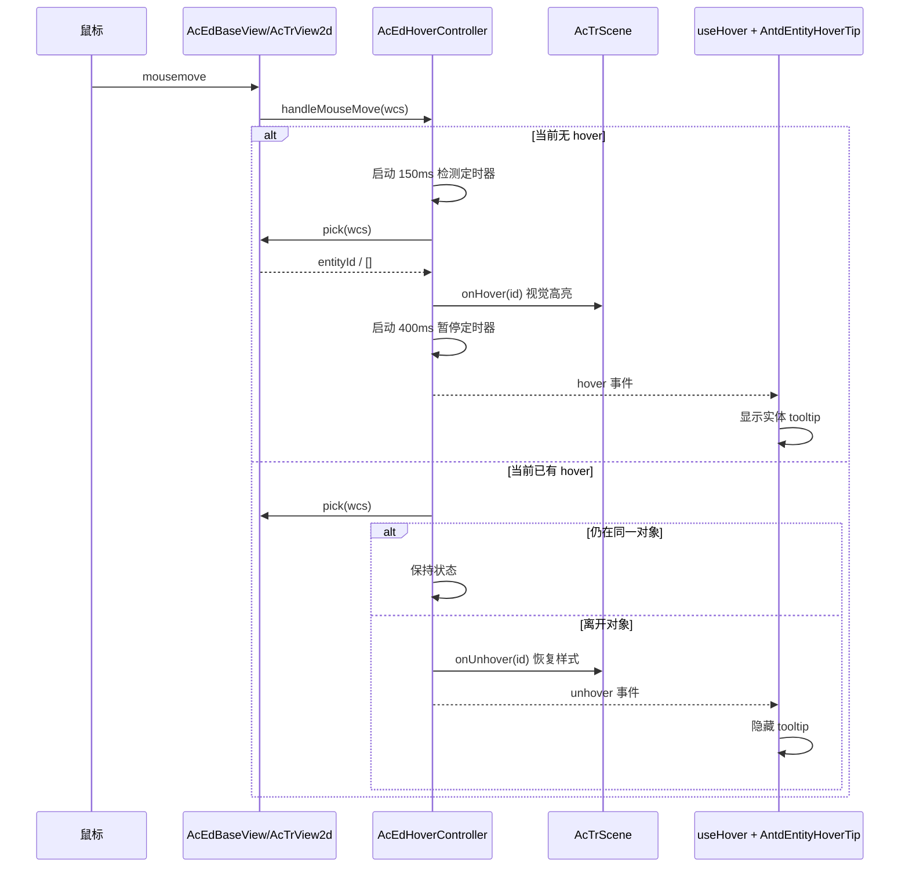
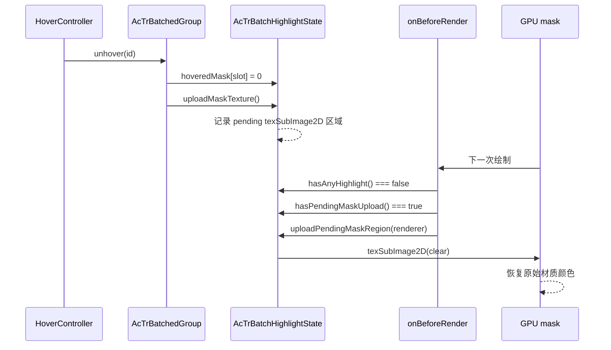

# 鼠标悬浮交互与移出恢复修复总结

- 日期：2026-09-10
- 涉及包：`cad-simple-viewer`、`three-renderer`、`cad-viewer`、`cad-viewer-example`
- 目标：
  1. 鼠标悬浮到图纸对象上时提供良好的交互反馈：高亮、实体信息提示、鼠标光标反馈。
  2. 鼠标移出对象或画布后，对象必须恢复原样式，不残留悬停虚线/高亮。
  3. 修复宽线（`LineSegments2` / `LineMaterial`）移出悬停后局部 mask 未上传导致"虚线不消失"的问题。

---

## 1. 交互约定

| 场景 | 行为 |
| --- | --- |
| 鼠标停在对象上 | 150ms 后应用悬停高亮；再经过 400ms 触发正式 `hover` 事件 |
| 悬停实体信息 | 显示实体类型、图层、颜色（含色块）、线型 |
| 鼠标悬停对象 | 画布光标切换为 `pointer`，移出后恢复原 CAD 十字光标 |
| 鼠标移出对象 | 立即清除该对象悬停高亮，并触发 `unhover` |
| 鼠标移出画布 | 清除悬停高亮、tooltip 与光标状态 |
| 切换到 PAN 模式 | 清除悬停状态 |
| 命令开始输入 | 清除悬停状态，避免悬停与命令输入态冲突 |
| 对象被选中 | 选中高亮保持；悬停高亮仍按上述规则独立清除 |

**视觉层与信息层分离**：

- `onHover`：立即应用视觉高亮，不依赖 Vue/UI。
- `hover` 事件：经过暂停确认后对外发布，供 tooltip 等 UI 使用。
- `onUnhover` / `unhover`：对象离开悬停时同步清除视觉与 UI 状态。

这样既保证高亮跟手，又避免鼠标快速划过时频繁弹出实体信息。

---
## 2. 总体事件流



---
## 3. 核心 hover 交互实现

### 3.1 `AcEdHoverController`

文件：`cad-viewer/packages/cad-simple-viewer/src/editor/view/AcEdHoverController.ts`

- 默认时间参数：
  - `hoverDelay = 150ms`：鼠标停止移动多久后执行 pick。
  - `pauseDelay = 400ms`：悬停确认后多久对外发布 `hover` 事件。
- 新增 `currentHoveredId` getter，便于调试和测试。
- 新增 `handleMouseLeave()`：显式处理画布 `mouseleave`，内部调用 `clear()`。
- `clear()` 统一负责：
  - 派发 `unhover`；
  - 调用宿主 `onUnhover` 恢复视觉；
  - 清理 hover/pause 定时器。

### 3.2 `AcEdBaseView`

文件：`cad-viewer/packages/cad-simple-viewer/src/editor/view/AcEdBaseView.ts`

- 画布注册 `mouseleave`：
  - 鼠标离开画布后不再有 `mousemove`，必须主动清理 hover，避免 tooltip/高亮残留。
- `onMouseMove` 中扩展清理条件：
  - 仅在 `SELECTION` 模式且编辑器未处于命令输入态时执行 hover 检测；
  - 其他情况（PAN、命令输入中）调用 `_hoverController.clear()`，防止旧状态残留。
- 监听 `editor.events.commandWillStart`：
  - 命令在鼠标静止状态下启动时，立即清除 hover，避免 tooltip 与命令输入重叠。

### 3.3 `AcTrView2d`

文件：`cad-viewer/packages/cad-simple-viewer/src/view/AcTrView2d.ts`

- 模式切换：
  - 从 `SELECTION` 离开时调用 `clearHover()`，避免平移时仍显示悬停虚线/顶点标记。
- 光标反馈：
  - 新增 `_cursorBeforeHover` 记录进入 hover 前的内联 cursor；
  - `onHover` 设置 `cursor = 'pointer'`；
  - `onUnhover` 原样恢复，保证自定义 SVG 十字光标不被破坏。

---
## 4. Vue 实体悬浮信息

### 4.1 `useHover` composable

文件：`cad-viewer/packages/cad-viewer/src/composable/useHover.ts`

职责：

- 订阅当前视图的 `events.hover` / `events.unhover`。
- 将事件中的 canvas 局部坐标转换为 viewport/client 坐标，供 DOM 定位使用。
- 解析悬停实体：
  1. 先查 `blockTable.modelSpace.getIdAt(id)`；
  2. 模型空间查不到时回退到 `blockTable.getEntityById(id)`，兼容图纸空间/其他块表记录。
- 返回响应式状态：

```ts
{
  hovered: Ref<boolean>,
  entity: Ref<AcDbEntity | null>,
  id: Ref<AcDbObjectId | null>,
  mouse: Ref<{ x: number; y: number }>
}
```

实现注意：

- `entity` 使用 `shallowRef`，避免对体积较大的实体对象做深度响应式代理。
- 组件卸载时移除事件监听，避免内存泄漏。

### 4.2 `AntdEntityHoverTip` 提示卡片

文件：`cad-viewer/packages/cad-viewer-example/src/shell/AntdEntityHoverTip.vue`

- 信息内容：
  - 实体类型（通过 `entityName` 本地化）；
  - 图层；
  - 颜色名称 + 色块（仅对 ByColor/ByACI 显示 RGB 色块）；
  - 线型。
- 定位：
  - 监听 canvas `pointermove` 实时取得鼠标位置；
  - 使用 `view.viewportToContainer()` 转换为容器坐标；
  - 默认显示在鼠标右下方，靠近右/下边缘时自动翻转；
  - 最终位置限制在画布范围内。
- 展示：
  - `pointer-events: none`，不干扰 CAD 交互；
  - 淡入 + 上移动画；
  - 主题变量适配浅色/深色。
- 集成位置：
  - 挂载在 `AntdCadViewer.vue` 的 `.antd-cad-content` 内，与 canvas 容器同层。

---
## 5. 移出对象后不恢复的根因与修复

### 5.1 现象

鼠标移出宽线对象后，对象仍保持悬停虚线，未恢复原实线样式。

### 5.2 根因：延迟 mask 上传未在最后一个高亮被清除时刷新

批处理高亮使用一张 GPU mask 纹理：

- R 通道：选中；
- G 通道：悬停。

为了减少上传带宽，单行 dirty 窗口使用 `gl.texSubImage2D` 局部上传，并把上传挂到对象的 `onBeforeRender`。

旧流程：

1. hover 时设置 mask 并绑定 uniform。
2. 移出对象时，CPU 侧 hover mask 已清零，并记录一个 pending 局部上传。
3. 下一次绘制进入 `installBatchHighlightRenderer` 的 `onBeforeRender`。
4. 此时 `state.hasAnyHighlight()` 已为 `false`，旧代码直接 `return`。
5. pending 的 `texSubImage2D` 永远不会执行。
6. GPU mask 仍保留旧 hover 位，shader 继续把线渲染成虚线。

因此对象看起来没有恢复原样式。

### 5.3 修复

1. `AcTrBatchHighlightState`
   - 新增 `hasPendingMaskUpload()`，暴露是否还有延迟上传。

2. `AcTrBatchHighlightShaders`
   - `onBeforeRender` 在没有高亮时不再无条件返回：
     - 如果存在 pending mask upload，则调用 `uploadPendingMaskRegion(renderer)` 刷新 GPU；
     - 然后再返回，不引入额外 uniform 绑定开销。

3. `AcTrBatchedMixin.flushHighlightMask()`
   - 记录 texture 对象是否被 `uploadMaskTexture()` 重新分配；
   - 当高亮已全部清除但 texture 对象发生变化时，仍然重新绑定材质，避免材质继续采样旧纹理；
   - texture 未变化时不重复绑定/上传，保持原有性能语义。

### 5.4 修复后的清除流程



---
## 6. 修改文件清单

| 文件 | 说明 |
| --- | --- |
| `cad-simple-viewer/src/editor/view/AcEdHoverController.ts` | 调整默认时间；新增 `handleMouseLeave`、`currentHoveredId` |
| `cad-simple-viewer/src/editor/view/AcEdBaseView.ts` | mouseleave 清理；非选择/命令输入态清理；commandWillStart 清理 |
| `cad-simple-viewer/src/view/AcTrView2d.ts` | 模式切换清理；悬停 pointer 光标及恢复 |
| `cad-simple-viewer/__tests__/AcEdHoverController.spec.ts` | 新增 mouseleave 回归用例 |
| `cad-viewer/src/composable/useHover.ts` | 新增悬停实体响应式 composable |
| `cad-viewer/src/composable/index.ts` | 导出 `useHover` |
| `cad-viewer-example/src/shell/AntdEntityHoverTip.vue` | 新增实体悬浮信息卡片 |
| `cad-viewer-example/src/shell/AntdCadViewer.vue` | 集成提示卡片 |
| `cad-viewer-example/src/shell/shell.css` | tooltip 样式与动画 |
| `cad-viewer-example/src/locale/zh.ts` / `en.ts` | 提示卡片中英文案 |
| `three-renderer/src/batch/highlight/AcTrBatchHighlightState.ts` | 新增 pending mask 查询 |
| `three-renderer/src/batch/highlight/AcTrBatchHighlightShaders.ts` | 无高亮时仍 flush pending mask |
| `three-renderer/src/batch/AcTrBatchedMixin.ts` | texture 重分配时重新绑定材质 |
| `three-renderer/__tests__/AcTrBatchHighlightStatePartialUpload.spec.ts` | 新增 pending clear / 下一帧 flush 回归测试 |

---

## 7. 验证

### 7.1 单元测试

| 范围 | 结果 |
| --- | --- |
| `cad-simple-viewer` 全量 | 76 套件 / 387 用例通过 |
| `three-renderer` 全量 | 58 套件通过，2 套件跳过；365 用例通过，2 跳过 |
| 重点回归 | `AcEdHoverController`、`AcEdSelectionVertexMarkers`、`AcTrView2d`、`AcTrBatchHighlightStatePartialUpload`、`AcTrBatchedGroupHighlight`、`AcTrBatchedGroupBulkRemove`、`useHover` 均通过 |

### 7.2 构建

```text
@hy/three-renderer     build 通过
@hy/cad-simple-viewer  build 通过
@hy/cad-viewer         build 通过
@hy/cad-viewer-example build 通过
```

### 7.3 Playwright 像素级验证

真实浏览器 + DXF 文件：

| 文件 | 验证点 | 结果 |
| --- | --- | --- |
| `minimal-line.dxf` | hover 前图面 hash vs 移出后图面 hash | 完全一致 |
| `visible-lwpolylines.dxf` | 宽线 hover 前 hash vs 移出后 hash | 完全一致；修复前残留 1160 个差异像素 |
| tooltip | 悬停对象后 `.antd-entity-hover-tip` 显示实体信息 | 通过 |
| cursor | 悬停时 `canvas.style.cursor === 'pointer'`，移出恢复 | 通过 |
| page errors | 整个交互过程无 `pageerror` | 通过 |

说明：文本/抗锯齿区域在不同帧之间可能存在极少量像素级抖动，因此回归判断以线宽对象大面积几何像素是否恢复为准，line/wide-line 场景已做到 hash 完全一致。

---

## 8. 已知边界与后续

- 实体悬浮信息卡片当前集成在 antd 示例壳层；其他宿主可复用 `useHover` 自行渲染。
- hover/pause 延迟目前为类内默认值，尚未接入系统变量或宿主配置项。
- 模型空间实体优先通过 `modelSpace.getIdAt` 解析；图纸空间实体走 `blockTable.getEntityById` 回退。
- 命令输入期间 hover 会被主动关闭；如果未来需要选择实体命令期间保留悬停提示，需要单独放开输入态判断。
- 局部 mask 上传仍受 `acTrSetBatchMaskPartialUploadEnabled` 开关控制；关闭后走整张纹理上传，不存在本问题，但开销更高。
